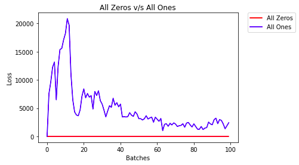
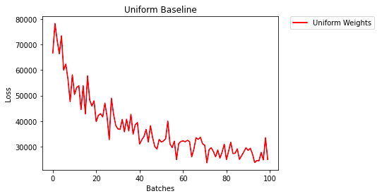
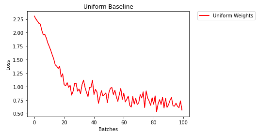
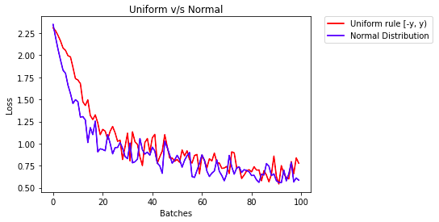
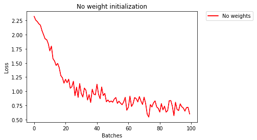

# Weight Initialization Strategies

This project talks about how you can initialize weights for your neural network for better accuracy. The below table summarizes results of using various weights and their compares them according to training and validation loss.

PyTorch implementation : [weight_initializaion_strategies](https://github.com/purvasingh96/Deep-learning-with-neural-networks/blob/master/Chapter-wise%20code/Code%20-%20PyTorch/2.%20Convolution%20Neural%20Networks/7.%20Weight%20Initialization%20Strategies/Weight_initialization.ipynb)

## Results and Conclusion
| Weight Initialization Strategy               | Comments                                                                                                                                    | Results                                               |
|----------------------------------------------|---------------------------------------------------------------------------------------------------------------------------------------------|-------------------------------------------------------|
| Uniform weight initialization with 0s and 1s | The neural network has a hard time determining which  weights need to be changed,   since the neurons have the same output  for each layer | </img>          |
| Uniform distribution between 0.0 and 1.0     | Better than case-1. Neural network  starts to learn.                                                                                          | </img>        |
| General Rule                                 | Model learns perfectly and training loss decreases gradually                                                                                | </img>           |
| Normal distribution v/s general rule         | Performs similar to general rule. Model  learns effectively.                                                                                 | </img>      |
| No weight initialization                     | Unexpected behaviour. PyTorch has its own default weight initialization strategy                                                            | </img> |
