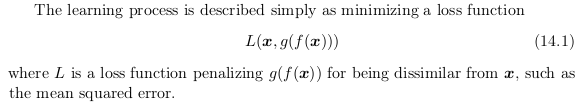

# Autoencoders

## Overview
Autoencoders are neural network that is trained to attemp to copy its input
to its output.  
The network may be viewed as consisting of two parts: an
encoder function h = f (x) and a decoder that produces a reconstruction r = g(h).
  
Key component of an autoencoder is its ability to compress such that image data is still retained.

## Architecture

Below is an architecture of autoencoder and its 2 components  -  **encoder and decoder**  
</img> <br.
PyTorch implementation of a simple auto-encoder can be found here -   

## Undercomplete Autoencoders
We don't want autoencoders to completely copy the contents of input image to the output image. This might seem useless. We just want that autoencoder **learns important features** of features instead of entire input.  

One way to obtain useful features from the autoencoder is to constrain h to
have smaller dimension than x. An autoencoder whose code dimension is less
than the input dimension is called **undercomplete.**  

Autoencoders with **nonlinear encoder functions f and nonlinear decoder functions g** can learn a more powerful nonlinear generalization of PCA.  
Undercomplete autoencoders fail to learn anything useful if the encoder and decoder are
given too much capacity.  
Learning an undercomplete
representation forces the autoencoder to capture the most salient features of the
training data.
</img>

## Regularized Autoencoders
Rather than limiting the model capacity by keeping the encoder
and decoder shallow and the code size small, regularized autoencoders use a loss
function that encourages the model to have **other properties besides the ability
to copy its input to its output.**  
These other properties include-
1. sparsity of the representation
2. smallness of the derivative of the representation
3. robustness to noise or to missing inputs.

### Sparse Autoencoders
A sparse autoencoder is simply an autoencoder whose training criterion involves a
sparsity penalty Ω(h) on the code layer h, in addition to the reconstruction error: 
</img>

### Denoising Autoencoders
Rather than adding a penalty Ω to the cost function, we can obtain an autoencoder
that learns something useful by changing the reconstruction error term of the cost
function.  
Traditionally, autoencoders minimize loss function which serves as a penalty term for x not being identical to x' 
</img>  
A **denoising autoencoder or DAE** instead minimizes -   
</img>  
where x̃ is a copy of x that has been corrupted by some form of noise. Denoising
autoencoders must therefore undo this corruption rather than simply copying their
input

## Representational Power, Layer Size and Depth
Experimentally, **deep autoencoders yield much better compression than corre-
sponding shallow or linear autoencoders.** 
A common strategy for training a deep autoencoder is to greedily pretrain
the deep architecture by training a stack of shallow autoencoders, so we often
encounter shallow autoencoders, even when the ultimate goal is to train a deep
autoencoder.

