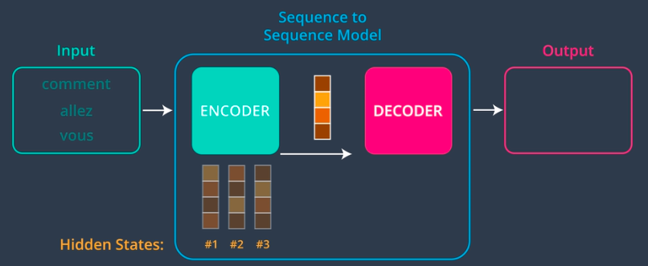
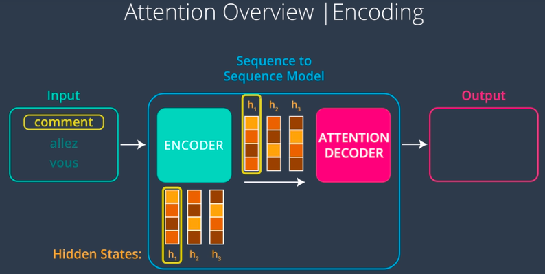
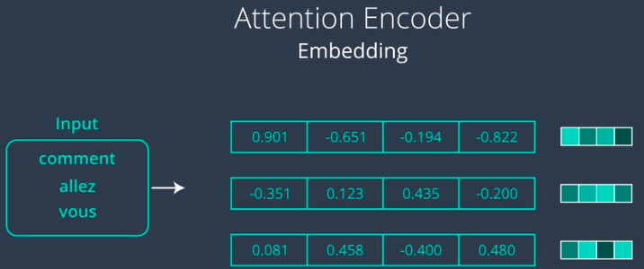
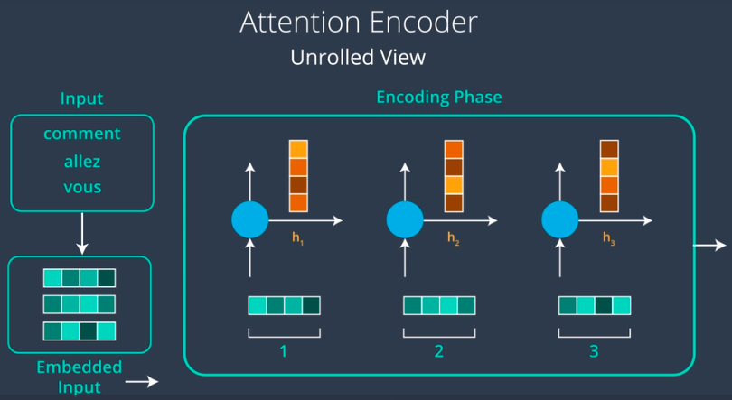
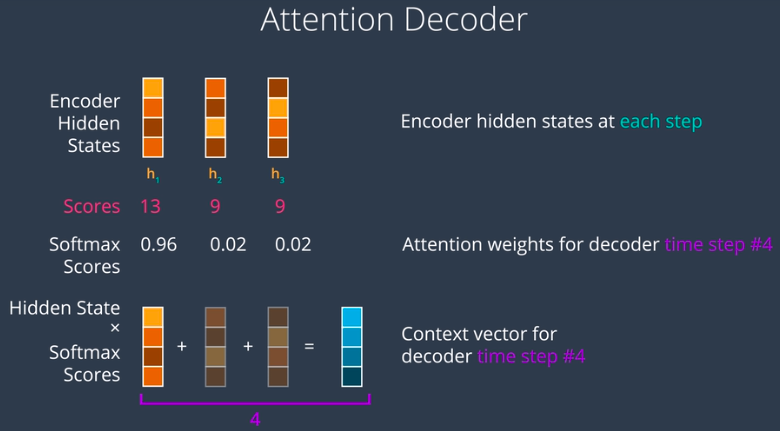
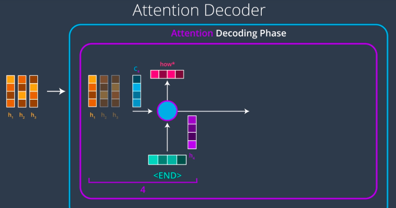
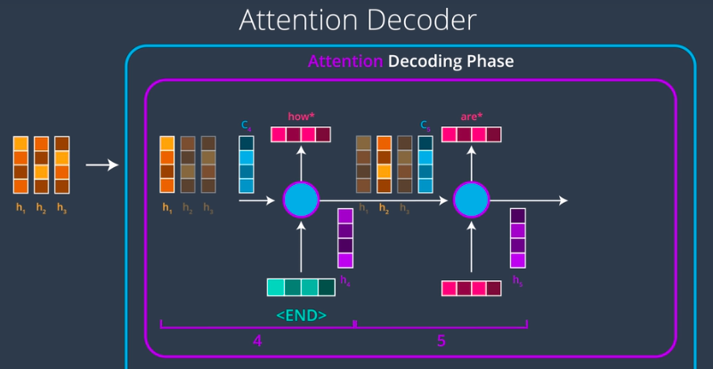

# Attention

## Sequence to Sequence Models (RNNs) 

### How RNNs work?

In order to better understand RNNs, let us take a look at an example of a machine translation model.  Here the model has 2 parts : **Encoder and Decoder**. We feed in the tokenzied input to encoder one-by-one. For the below example, we first feed the word **Comment** to encoder, which geneates it corresponding **hidden layer #1**. Next, we feed encoder, the 2nd word **allez**. The **hidden layer #2** is formed using **hidden layer #1 plus tokenzied word** and so on. Finally the **hidden layer #3** generated for the last word is what is fed as **context** to decoder.  
</img>

### Drawback of RNN

The drawback of RNN or any sequence model is that it is confined to sending a single vector, no matter how long or short the input sequence is. Chosing the size for this vector makes the model have problems with long input sequences. In this case, one may suggest to use large sizes of hidden layers, but in this case, your model will overfit for short sequences. This is the problem that **Attention** solves.

## Attention Overview 
The first part of encoder is similar to sequence-to-sequence model, i.e. generating hidden layers one word at a time. The difference comes when we create context. Here instead of passing just one final hidden state as context to decoder, the encoder passes all of the hidden states to decoder.  
This gives us the flexibility of context size, i.e. longer sequences can have longer context vectors. One point to note here is that every hidden layer captures the most escence of its corresponding word. For e.g. hidden layer #1 will have more information about the word *comment* as compared to other words.  
</img>

### Attention Encoder : Unrolled View

Lets have a closer look at our attention encoder and we refer to the same example of language translation from French to English.  
1. First, we pass the french sentence to an embedding look-up table, that stores the vectorized form of words in a table.  
</img>  
2. After we have the embedding layer, when we feed the first word into the first time-step of RNN produces the first hidden state of RNN. This is known as *Unrolled View of RNN*, where we can see RNN at each timestep.  
</img>  

### Attention Decoder

1. After we have processed the entire sequence, we are ready to feed in the hidden state to the attention decoder. At first, attention decoder will allocate scores to the hidden states generated from the input. After this, decoder feeds the scores to a *softmax function* whic makes sure that all scores are *positive, between 0 to 1 and all of them adds up to 1*.  
</img>  

2. After assigning softmax scores, decoder creates a *Context vector* by multiplying hidden states with their respective softmax scores. 
3. After creating a Context vector, decoder generates a *new hidden state and an output (translated word)*.  
</img>  
4. The same process is repeated till the end of sequence is reached.  
</img>  

## Applications of Attention

1. Machine translation
2. Document Summarization
3. Dailgoue Exchange
4. Image Caption Generator
