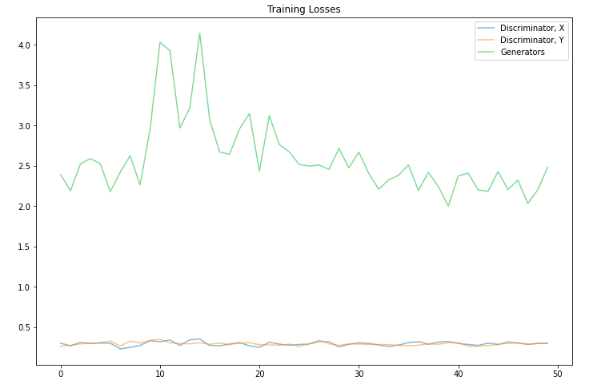
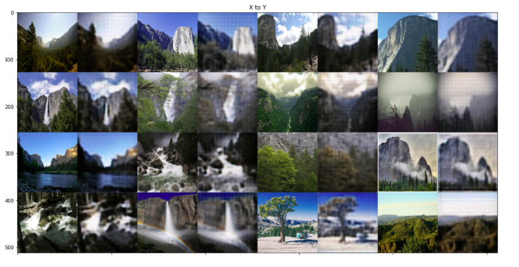
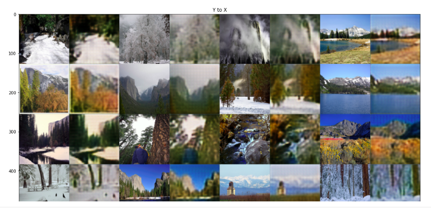

# Cyclic GANs

In this notebook, we're going to define and train a CycleGAN to read in an image from a set  𝑋  and transform it so that it looks as if it belongs in set  𝑌 . Specifically, we'll look at a set of images of Yosemite national park taken either during the summer of winter. The seasons are our two domains!

## Algorithm 

1. Get data, pre-process it and create data-loaders.
2. Define the CycleGAN model : Discriminator & Generator
    * **Discriminator**
        * This network sees a 128x128x3 image, and passes it through 5 convolutional layers that downsample the image by a factor of 2. 
        *  The first four convolutional layers have a BatchNorm and ReLu activation function applied to their output
        *  The last acts as a classification layer that outputs one value.
    *  **Generator**
        * There are 2 generators : G_XtoY and G_YtoX
        * These 2 generators are made of : Encoder and Decoder
            * **Encdoer :**  A conv net that is responsible for turning an image into a smaller feature representation.
            * **Decoder :** A `transpose_conv net` that is responsible for turning that representation into an transformed image.
            * **Residual Block :** Connects encoder and decoder parts.
3. Compute the Generator and Discriminator and Cycle-Consistence Loss (determines how good a reconstructed image is, when compared to an original image.)
```python
def real_mse_loss(D_out):
  return torch.mean((D_out-1)**2)

def fake_mse_loss(D_out):
  return torch.mean(D_out**2)

def cycle_consistency_loss(real_im, reconstructed_im, lambda_weight):
  reconstr_loss = torch.mean(torch.abs(real_im - reconstructed_im))
  return lambda_weight * reconstr_loss
```
4. Define the optimizer.
5. Training the cycleGAN : <br>
  * **Training the Discriminators**
      * Compute the discriminator  𝐷𝑋  loss on real images
      * Generate fake images that look like domain  𝑋  based on real images in domain  𝑌 
      * Compute the fake loss for  𝐷𝑋 
      * Compute the total loss and perform backpropagation and  𝐷𝑋  optimization
      * Repeat steps 1-4 only with  𝐷𝑌  and your domains switched!
  
  * **Training the Generators**
      * Generate fake images that look like domain  𝑋  based on real images in domain  𝑌 
      * Compute the generator loss based on how  𝐷𝑋  responds to fake  𝑋 
      * Generate reconstructed  𝑌̂   images based on the fake  𝑋  images generated in step 1
      * Compute the cycle consistency loss by comparing the reconstructions with real  𝑌  images
      * Repeat steps 1-4 only swapping domains
      * Add up all the generator and reconstruction losses and perform backpropagation + optimization

6. Compute training loss and save samples from generator

## Results

1. Training loss of generator and discriminator are as follows - <br>
    * Discriminator loss : 0.3021 (X) , 0.3054 (Y)
    * Generator Loss : 2.4846

2. Training loss plotted v/s no.of epochs trained - <br>
</img>

3. Final results of generating CycleGAN :<br>

### Image-to-image translation (Converting summer images to winter images)
</img><br>


### Image-to-image translation (Converting winter images to summer images)
</img><br>


