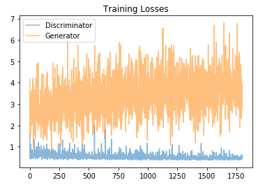
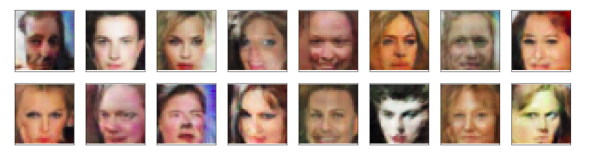

# Generating fake faces using GANs

## Algorithm
In this project, you'll define and train a DCGAN on a dataset of faces. Your goal is to get a generator network to generate new images of faces that look as realistic as possible! 

1. Get the celeb faces data, pre-process it and load the data.
2. Define the model :  Discriminator and Generator
    * **Discriminator**
      * The inputs to the discriminator are 32x32x3 tensor images
      * 3 convolutional layers, 1 fully-connected layer and leaky_relu activation function.
      * The output should be a single value that will indicate whether a given image is real or fake
    * **Generator**
      * The inputs to the generator are vectors of some length z_size
      * 3 transpose_convolutional_layer, 1 fully-connected layer and 1 relu activation function
      * The output should be a image of shape 32x32x3
3. Generate discriminator and generator losses
    * **Discriminator Loss**
        * For the discriminator, the total loss is the sum of the losses for real and fake images, `d_loss = d_real_loss + d_fake_loss.`
        * Remember that we want the discriminator to output 1 for real images and 0 for fake images, so we need to set up the losses to reflect that.
    * **Generator Loss**
        * The generator loss will look similar only with flipped labels.
4. Train the network
5. Plot the loss
6. Generator samples from training

## Results

1. Final discriminator and generator loss are as follows -  
    * Discriminator loss : 0.4530
    * Generator loss     : 3.5706
    
2. Training loss of discrimiator and generator plotted over each epoch -  
</img>  

3. Fake face images generated after training the GAN - 
</img>  

