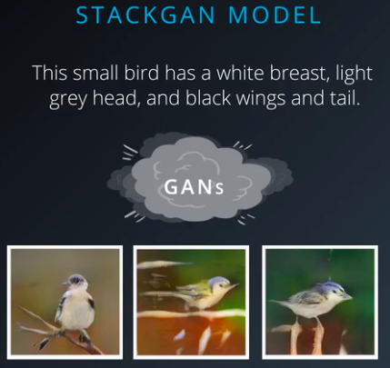
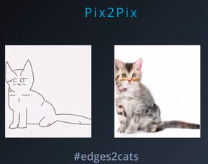
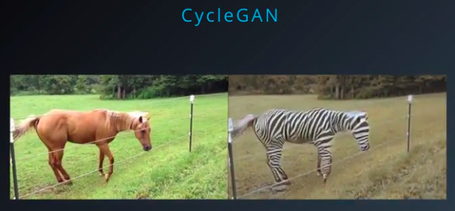

# Generative Adversarial Networks

## Applications of GANs

Following are some of the examples of GANs - 

## Stack GANs
They are used to generate realistic data. It is used to take in a textual representation of a bird and generates a high-resolution photo of a bird, matching that description. Point to note is that these images have never been seen before and are totally imaginary.  
</img>

## Pix2Pix GANs
As an artist draws a painting, the Pix2Pix GAN looks for the nearest possible realistic image. Pix2Pix GAN is also used for image-to-image translation e.g. blue-prints of buildings can be converted to photos of finished buildings.
  
</img>

## Cycle GANs
Cycle GANs are used for unsupervised image-to-image translation. E.g. changing video of horse to video of zebra.
  
</img>
