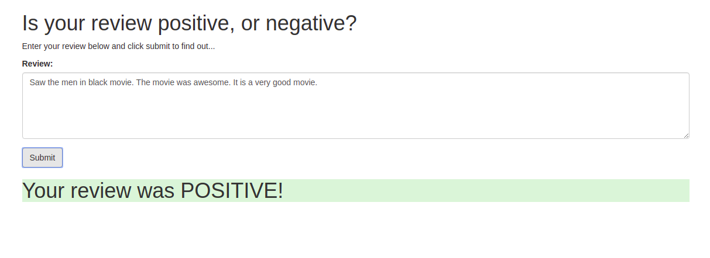
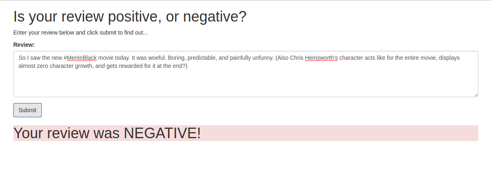

# Deploying Sentiment Analysis Model to PROD using Amazon SageMaker

## Algorithm
1. Download or otherwise retrieve the data.
2. Process / Prepare the data.
3. Upload the processed data to S3.
4. Build and train the pytorch model.
5. Test the trained model (typically using a batch transform job).
6. Deploy the trained model.
7. Use the deployed model and delete the end-point after use.
8. Re-deploy the model for web-app.
    * Create a Lambda function and assign it an IAM role.
    * Set-up the API gateway
9. Deploy the end-point to PROD.

## Results

### Testing the web-app on positive reviews 

</img>  

### Testing the web-app on negative reviews 

</img>  

## Notes
In order to raise ticket follow the below link- 

[support ticket for instance capacity raise](https://console.aws.amazon.com/support/home?region=ap-south-1#/case/?displayId=7076603351&language=en)
