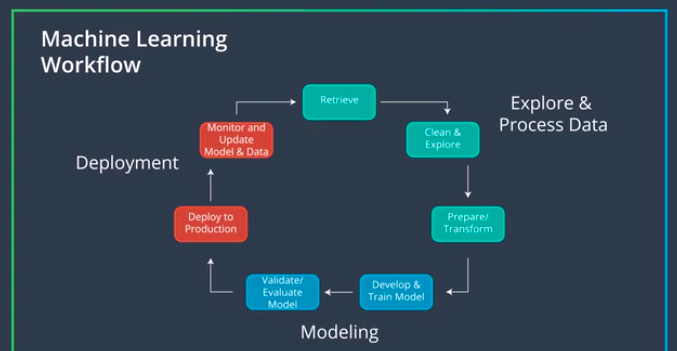

# Deploying PyTorch Models to Production via Amazon SageMaker

## Machine Learning Workflow
Below diagram describes the overall workflow pattern in a typical machine learning model deployment.  
</img>

## Setting up Amazon SageMaker Account

### Step 1: Setting up a notebook instance

Sign-in to your amazon-sagemaker console account and search for *Amazon SageMaker* under *Machine Learning* heading.  
</img>  

After clicking on *Amazon SageMaker*, you will land on *Sagemaker's dashboard*. Here, click on *Notebook instances* under *Notebook* section on the right.  
</img>  

*Notebook instances* dashboard should look something like this, if there are no instances of notebook running.  
</img>  

In order to create a notebook, click on *Create Notebook Instance* in the top right corner. After this, give a name to your notebook.  
</img>  

Next, under IAM role select Create a new role. You should get a pop-up window that looks like the one below. The only change that needs to be made is to select None under S3 buckets you specify, as is shown in the image below.  
</img>  

Final screenshot before running the notebook instance should look something like this -  
</img>  

*Note:* Your notebook name may be different than the one displayed and the IAM role that appears will be different.  

Now scroll down and click on Create notebook instance.  
</img>  

Once your notebook instance has started and is accessible, click on open to get to the Jupyter notebook main page.  

