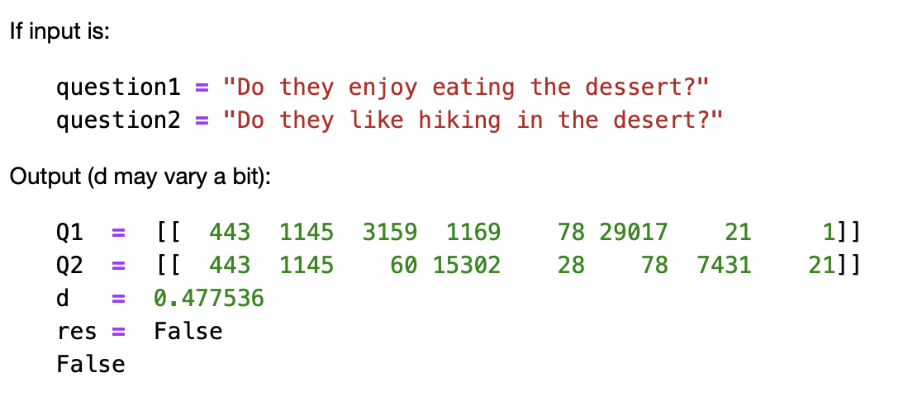

# Handling Question duplicates using Siamese Networks

In this section I have explored Siamese networks applied to natural language processing and fundamentals of Trax. I learned how to implement models with different architectures. 

## Outline

- [Overview](#0)
- [Part 1: Importing the Data](#1)
    - [1.1 Loading in the data](#1.1)
    - [1.2 Converting a question to a tensor](#1.2)
        
- [Part 2: Defining the Siamese model](#2)
    - [2.1 Understanding Siamese Network](#2.1)
        
    - [2.2 Hard  Negative Mining](#2.2)
        
- [Part 3: Training](#3)
    - [3.1 Training the model](#3.1)
- [Part 4: Evaluation](#4)
    - [4.1 Evaluating our siamese network](#4.1)
    - [4.2 Classify](#4.2)
- [Part 5: Testing with our own questions](#5)
- [On Siamese networks](#6)

### Overview
In this section, we will: 

- Learn about Siamese networks
- Understand how the triplet loss works
- Understand how to evaluate accuracy
- Use cosine similarity between the model's outputted vectors
- Use the data generator to get batches of questions
- Predict using our own model

We will start by preprocessing the data. After processing the data we will build a classifier that will allow us to identify whether to questions are the same or not. 
We will process the data first and then perform padding. Our model will take in the two question embeddings, run them through an LSTM, and then compare the outputs of the two sub networks using cosine similarity.

# Part 1: Importing the Data

### 1.1 Loading in the data

We will be using the Quora question answer dataset to build a model that could identify similar questions. This is a useful task because we don't want to have several versions of the same question posted. 

</img>

### 1.2 Converting a question to a tensor

You will now convert every question to a tensor, or an array of numbers, using our vocabulary built above.

# Part 2: Defining the Siamese model

### 2.1 Understanding Siamese Network 
A Siamese network is a neural network which uses the same weights while working in tandem on two different input vectors to compute comparable output vectors.The Siamese network we are about to implement looks like this:

</img>

we get the question embedding, run it through an LSTM layer, normalize `v_1` and `v_2`, and finally use a triplet loss (explained below) to get the corresponding cosine similarity for each pair of questions. As usual, we will start by importing the data set. The triplet loss makes use of a baseline (anchor) input that is compared to a positive (truthy) input and a negative (falsy) input. The distance from the baseline (anchor) input to the positive (truthy) input is minimized, and the distance from the baseline (anchor) input to the negative (falsy) input is maximized. In math equations, we are trying to maximize the following.

</img>

`A` is the anchor input, for example `q1_1`, `P` the duplicate input, for example, `q2_1`, and `N` the negative input (the non duplicate question), for example `q2_2`. 
`\alpha` is a margin; we can think about it as a safety net, or by how much we want to push the duplicates from the non duplicates. 
 

### Exercise 02

**Instructions:** Implement the `Siamese` function below. we should be using all the objects explained below. 

To implement this model, we will be using `trax`. Concretely, we will be using the following functions.

- `tl.Serial`: Combinator that applies layers serially (by function composition) allows we set up the overall structure of the feedforward. [docs](https://trax-ml.readthedocs.io/en/latest/trax.layers.html#trax.layers.combinators.Serial) / [source code](https://github.com/google/trax/blob/1372b903bb66b0daccee19fd0b1fdf44f659330b/trax/layers/combinators.py#L26)
    - we can pass in the layers as arguments to `Serial`, separated by commas. 
    - For example: `tl.Serial(tl.Embeddings(...), tl.Mean(...), tl.Dense(...), tl.LogSoftmax(...))` 

-  `tl.Embedding`: Maps discrete tokens to vectors. It will have shape (vocabulary length X dimension of output vectors). The dimension of output vectors (also called d_feature) is the number of elements in the word embedding. [docs](https://trax-ml.readthedocs.io/en/latest/trax.layers.html#trax.layers.core.Embedding) / [source code](https://github.com/google/trax/blob/1372b903bb66b0daccee19fd0b1fdf44f659330b/trax/layers/core.py#L113)
    - `tl.Embedding(vocab_size, d_feature)`.
    - `vocab_size` is the number of unique words in the given vocabulary.
    - `d_feature` is the number of elements in the word embedding (some choices for a word embedding size range from 150 to 300, for example).

-  `tl.LSTM` The LSTM layer. It leverages another Trax layer called [`LSTMCell`](https://trax-ml.readthedocs.io/en/latest/trax.layers.html#trax.layers.rnn.LSTMCell). The number of units should be specified and should match the number of elements in the word embedding. [docs](https://trax-ml.readthedocs.io/en/latest/trax.layers.html#trax.layers.rnn.LSTM) / [source code](https://github.com/google/trax/blob/1372b903bb66b0daccee19fd0b1fdf44f659330b/trax/layers/rnn.py#L87)
    - `tl.LSTM(n_units)` Builds an LSTM layer of n_units.
    
    
- `tl.Mean`: Computes the mean across a desired axis. Mean uses one tensor axis to form groups of values and replaces each group with the mean value of that group. [docs](https://trax-ml.readthedocs.io/en/latest/trax.layers.html#trax.layers.core.Mean) / [source code](https://github.com/google/trax/blob/1372b903bb66b0daccee19fd0b1fdf44f659330b/trax/layers/core.py#L276)
    - `tl.Mean(axis=1)` mean over columns.

- `tl.Fn` Layer with no weights that applies the function f, which should be specified using a lambda syntax. [docs](https://trax-ml.readthedocs.io/en/latest/trax.layers.html#trax.layers.base.Fn) / [source doce](https://github.com/google/trax/blob/70f5364dcaf6ec11aabbd918e5f5e4b0f5bfb995/trax/layers/base.py#L576)
    - `x` -> This is used for cosine similarity.
    - `tl.Fn('Normalize', lambda x: normalize(x))` Returns a layer with no weights that applies the function `f`
    
    
- `tl.parallel`: It is a combinator layer (like `Serial`) that applies a list of layers in parallel to its inputs. [docs](https://trax-ml.readthedocs.io/en/latest/trax.layers.html#trax.layers.combinators.Parallel) / [source code](https://github.com/google/trax/blob/37aba571a89a8ad86be76a569d0ec4a46bdd8642/trax/layers/combinators.py#L152)

### 2.2 Hard  Negative Mining

we will now implement the `TripletLoss`. 
As explained in the lecture, loss is composed of two terms. One term utilizes the mean of all the non duplicates, the second utilizes the *closest negative*. Our loss expression is then:
 
</img>

Further, two sets of instructions are provided. The first set provides a brief description of the task. If that set proves insufficient, a more detailed set can be displayed.  

### Exercise 03

**Instructions (Brief):** Here is a list of things we should do:  

- As this will be run inside trax, use `fastnp.xyz` when using any `xyz` numpy function
- Use `fastnp.dot` to calculate the similarity matrix `v_1v_2^T` of dimension `batch_size` x `batch_size`
- Take the score of the duplicates on the diagonal `fastnp.diagonal`
- Use the `trax` functions `fastnp.eye` and `fastnp.maximum` for the identity matrix and the maximum.

# Part 3: Training

Now we are going to train our model. As usual, we have to define the cost function and the optimizer. we also have to feed in the built model. Before, going into the training, we will use a special data set up. We will define the inputs using the data generator we built above. The lambda function acts as a seed to remember the last batch that was given. Run the cell below to get the question pairs inputs. 

### 3.1 Training the model

we will now write a function that takes in our model and trains it. To train our model we have to decide how many times we want to iterate over the entire data set; each iteration is defined as an `epoch`. For each epoch, we have to go over all the data, using our training iterator.

### Exercise 04

**Instructions:** Implement the `train_model` below to train the neural network above. Here is a list of things we should do, as already shown in lecture 7: 

- Create `TrainTask` and `EvalTask`
- Create the training loop `trax.supervised.training.Loop`
- Pass in the following depending on the context (train_task or eval_task):
    - `labeled_data=generator`
    - `metrics=[TripletLoss()]`,
    - `loss_layer=TripletLoss()`
    - `optimizer=trax.optimizers.Adam` with learning rate of 0.01
    - `lr_schedule=lr_schedule`,
    - `output_dir=output_dir`

we will be using our triplet loss function with Adam optimizer. Please read the [trax](https://trax-ml.readthedocs.io/en/latest/trax.optimizers.html?highlight=adam#trax.optimizers.adam.Adam) documentation to get a full understanding. 

This function should return a `training.Loop` object. To read more about this check the [docs](https://trax-ml.readthedocs.io/en/latest/trax.supervised.html?highlight=loop#trax.supervised.training.Loop).

# Part 4:  Evaluation  

### 4.1 Evaluating our siamese network

In this section we will learn how to evaluate a Siamese network. we will first start by loading a pretrained model and then we will use it to predict. 

### 4.2 Classify
To determine the accuracy of the model, we will utilize the test set that was configured earlier. While in training we used only positive examples, the test data, Q1_test, Q2_test and y_test, is setup as pairs of questions, some of which are duplicates some are not. 
This routine will run all the test question pairs through the model, compute the cosine simlarity of each pair, threshold it and compare the result to  y_test - the correct response from the data set. The results are accumulated to produce an accuracy.

### Exercise 05

**Instructions**  
 - Loop through the incoming data in batch_size chunks
 - Use the data generator to load q1, q2 a batch at a time. **Don't forget to set shuffle=False!**
 - copy a batch_size chunk of y into y_test
 - compute v1, v2 using the model
 - for each element of the batch
        - compute the cos similarity of each pair of entries, v1[j],v2[j]
        - determine if d > threshold
        - increment accuracy if that result matches the expected results (y_test[j])
 - compute the final accuracy and return
 
Due to some limitations of this environment, running classify multiple times may result in the kernel failing. If that happens *Restart Kernal & clear output* and then run from the top. During development, consider using a smaller set of data to reduce the number of calls to model(). 

# Part 5: Testing with our own questions

In this section we will test the model with our own questions. we will write a function `predict` which takes two questions as input and returns `1` or `0` depending on whether the question pair is a duplicate or not.   

But first, we build a reverse vocabulary that allows to map encoded questions back to words: 

Write a function `predict`that takes in two questions, the model, and the vocabulary and returns whether the questions are duplicates (`1`) or not duplicates (`0`) given a similarity threshold. 

### Exercise 06

**Instructions:** 
- Tokenize our question using `nltk.word_tokenize` 
- Create Q1,Q2 by encoding our questions as a list of numbers using vocab
- pad Q1,Q2 with next(data_generator([Q1], [Q2],1,vocab['<PAD>']))
- use model() to create v1, v2
- compute the cosine similarity (dot product) of v1, v2
- compute res by comparing d to the threshold

###   Output of Siamese Networks 

</img>
</img>

###   On Siamese networks 

Siamese networks are important and useful. Many times there are several questions that are already asked in quora, or other platforms and we can use Siamese networks to avoid question duplicates. 

