# Machine Translation using Basic Linear Algebra

## 1. Generate French and English Word Embedding

Here, we have 3 given parameters:
1. `en_embeddings`: English words and their corresponding embeddings. 
  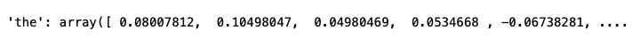</img>

2. `fr_embeddings`: French words and their corresponding embeddings. 
  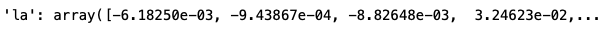</img>
 
3. `en_fr`: English to French dictionary. 
  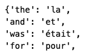</img>

Now, we have to create an English embedding matrix and French embedding matrix: 
  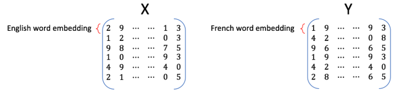</img> 

## 2. Linear Transformation of Word Embeddings
Given dictionaries of English and French word embeddings we will create a transformation matrix `R`. In other words, given an english word embedding, `e`, we need to multiply `e` with `R`, i.e., (`eR`) to generate a new word embedding `f`.

### Describing Translation Problem as the Minimization Problem
We can describe our translation problem as finding a matrix `R` that minimizes the following equation:  
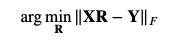</img> 
For this, we calculate the loss by modifying the original *Forbenius norm* : 
Original Forbenius Norm: 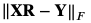</img> 
Modified Forbenius Norm: 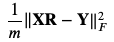</img> 
Finally, our loss funtion will look something like this: 
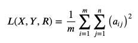</img> 
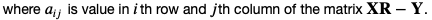</img>

## 3. Computing Gradient of Loss w.r.t R
Now, in order to optimize the value of R (from a random squared matrix to an optimal value), we need to perform calculate the gradient of the loss we calculated in Step 2, w.r.t the transform matrix `R`. The formula for calculating the gradient of the *Loss Function*, `L(X, Y, R)` is: 
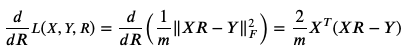</img> 

## 4. Finding the Optimal R with Gradient Descent Algorithm
Gradient descent is an iterative algorithm which is used in searching for the optimum of the function. Here, we calculate gradient `g` of the loss with respect to the matrix, `R` *(Step 3)*. Next, we update the original `R` with the formula: 
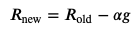</img> 
where, `alpha` is the learning rate (scalar quantity).

## 5. Testing the Translation via K-NN Algorithm
`k-NN` (K-Nearest Neighbours) is a method which takes a vector as input and finds the other vectors in the dataset that are closest to it. The 'k' is the number of "nearest neighbors" to find (e.g. k=2 finds the closest two neighbors). 

Since we're approximating the translation function from English to French embeddings by a linear transformation matrix `R`, most of the time we won't get the exact embedding of a French word when we transform embedding `e` of some particular English word into the French embedding space. 

By using `1-NN` with `eR` as input, we can search for an embedding `f` (as a row) in the matrix `Y` which is the closest to the transformed vector `eR`. In order to find the the similarity between two vectors `u` and `v`, we calculate the cosine of the angle between them using the formula: 
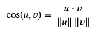</img> 

## 6. Calculating the Accuracy
Finally, we calculate the accuracy of our translation model using the following formula: 
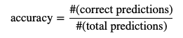</img> 
Using the formula above, our model achieved an accuracy of `55.7%` on unseen data. This transaltion was achieved by using some basic linear algebra and learning a mapping of words from one language to another!

# Code
You can find the entire code (Python) for Machine Translation (English-to-French) over [here](https://github.com/purvasingh96/Deep-learning-with-neural-networks/blob/master/Chapter-wise%20code/Code%20-%20PyTorch/6.%20Natural-Language-Processing/6.%20Machine%20Translation/NMT-Basic/Machine_translation_using_linear_algebra.ipynb).

