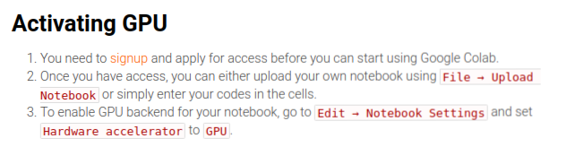
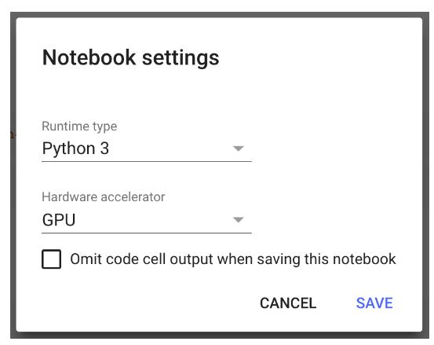
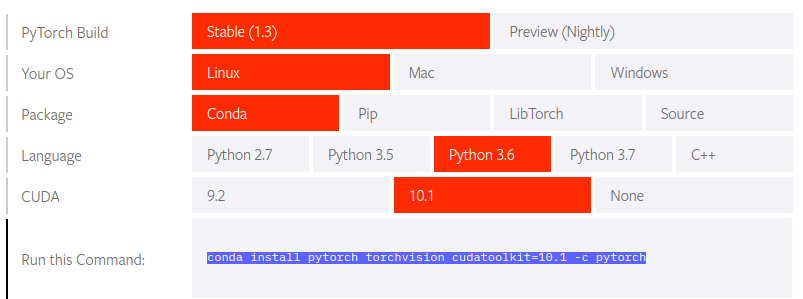

<p align="center"></p>

--------------------------------------------------------------------------------

# Deep Learning with PyTorch

This repository provides tutorial code for deep learning researchers to learn [PyTorch](https://github.com/pytorch/pytorch). My reference for this repository's content is from [Udacity's Bertelsmann Scholarship for AI track](https://www.udacity.com/bertelsmann-tech-scholarships). Before starting this tutorial, it is recommended to finish [Official Pytorch Tutorial](http://pytorch.org/tutorials/beginner/deep_learning_60min_blitz.html)

* **Part 1:** Introduction to PyTorch and using tensors
* **Part 2:** Building fully-connected neural networks with PyTorch
* **Part 3:** How to train a fully-connected network with backpropagation on MNIST
* **Part 4:** Exercise - train a neural network on Fashion-MNIST
* **Part 5:** Using a trained network for making predictions and validating networks
* **Part 6:** How to save and load trained models
* **Part 7:** Load image data with torchvision, also data augmentation
* **Part 8:** Use transfer learning to train a state-of-the-art image classifier for dogs and cats


<br>
</img><br>
</img><br>

## Get Started Locally

### Install and Launch Jupyter Notebook

To **install** jupyter notebook, run the following command - 
```
conda install numpy jupyter notebook
```
If you haven't used conda before, please read the [documentation](https://conda.io/en/latest/) to learn how to create environments and install packages. I suggest installing Miniconda instead of the whole Anaconda distribution. The normal package manager pip also works well. 

To **launch** jupyter notebook, run the following command - 
```
jupyter notebook
```

Your jupyter notebook should be running on **localhost:8888**

### Install Pytorch

The easiest way to install PyTorch and torchvision locally is by following the instructions on the [PyTorch site](https://pytorch.org/get-started/locally/). <br>


```
conda install pytorch torchvision cudatoolkit=10.1 -c pytorch
```

### Installing helper module

To install **helper module** 

```
pip install torch-helpers
```

Or

```
!wget https://raw.githubusercontent.com/udacity/deep-learning-v2-pytorch/3bd7dea850e936d8cb44adda8200e4e2b5d627e3/intro-to-pytorch/helper.py
```

### Verification 
To ensure that PyTorch was installed correctly, we can verify the installation by running [sample PyTorch code.](https://github.com/purvasingh96/Deep-learning-with-neural-networks/blob/master/Deep-learning-with-pytorch/01.verify_pytorch_installation.ipynb) 


### Few Important Links
1. [Basics of Numpy](https://jakevdp.github.io/PythonDataScienceHandbook/02.02-the-basics-of-numpy-arrays.html)
2. [PyTorch nn.Module Syntax](https://pytorch.org/docs/stable/nn.html)
