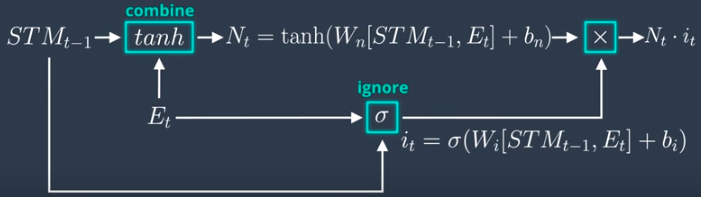

# Long Short Term Memory (LSTM)

## Basics of LSTM

Basic RNN was unable to retain long term memory to make prediction regarding the current picture is that od a wolf or dog. This is where LSTM comes into picture. The LSTM cell allows a recurrent system to learn over many time steps without the fear of losing information due to the vanishing gradient problem. It is fully differentiable, therefore gives us the option of easily using backpropagation when updating the weights. Below is the a sample mathematical model of an LSTM cell -  

</img> 

In an LSTM, we would expect the following behaviour -

| Expected Behaviour of LSTM                                                                   | Reference Diagram                                                       |
|----------------------------------------------------------------------------------------------|-------------------------------------------------------------------------|
| 1. Long Term Memory (LTM) and Short Term Memory (STM) to combine and produce correct output. |  |
| 2. LTM and STM and event should update the new LTM.                                          | </img>  </img>  |
| 3. LTM and STM and event should update the new STM.                                          | </img>          |

## How LSTMs work?

| LSTM consists of 4 types of gates -   1. Forget Gate   2. Learn Gate  3. Remember Gate  4. Use Gate  | </img> |
|-------------------------------------------------------------------------------------------------|--------------------------------------------------------------------------------------|

### LSTM Explained
Assume the following - 
1. LTM = Elephant
2. STM = Fish
3. Event = Wolf/Dog

| LSTM Operations                                                                                                                                                                                            | Reference Video                                      |
|------------------------------------------------------------------------------------------------------------------------------------------------------------------------------------------------------------|------------------------------------------------------|
| **LSTM places LTM, STM and Event as follows -**  1. Forget Gate = LTM   2. Learn Gate = STM + Event  3. Remember Gate = LTM + STM + Event  4. Use Gate = LTM + STM + Event  5. In the end, LTM and STM are updated.  | </img> |

## Learn Gate
Learn gate takes into account **short-term memory and event** and then ignores a part of it and retains only a part of information. 
</img>

### Mathematically Explained
STM and Event are combined together through **activation function** (tanh), which we further multiply it by a **ignore factor** as follows - 

</img>

## Forget Gate
Forget gate takes into account the LTM and decides which part of it to keep and which part of LTM is useless and forgets it. LTM gets multiplied by a **forget factor** inroder to forget useless parts of LTM.  
</img>

## Remember Gate
Remember gate takes LTM coming from Forget gate and STM coming from Learn gate and combines them together. Mathematically, remember gate adds LTM and STM.  
</img> </img>

## Use Gate
Use gate takes what is useful from LTM and what's useful from STM and generates a new LTM.  
</img> </img>

