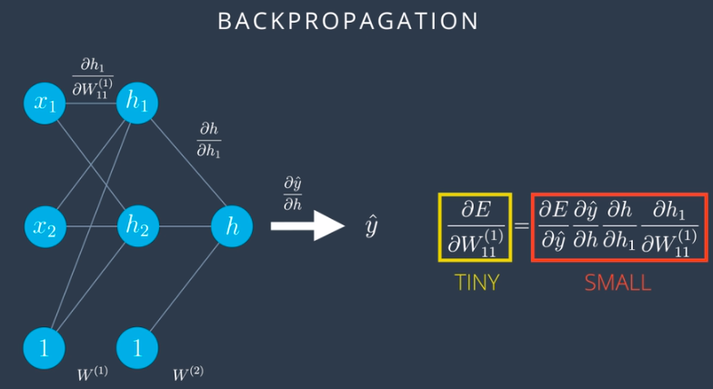

# Recurrent Neural Networks (RNNs)

## Overview

Consider an example given below where the neural network has to identify whether the white animal is a wolf/dog/goldfish. Now, based
on the probability distribution, the neural network predicts that the animal is a **Dog**, which is wrong, the correct prediction is
**wolf.**   
</img>

Now in order to correct this, we take help of RNNs, where we take help of previous images shown to neural network, to hint to us that
the current image is that of a wolf.  
</img>

In RNNs, the current state depends on the input as well as the previous states, with the use of an activation function. The current output is a simple linear combination of the current state elements with the corresponding weight matrix. 
</img> 
We can represent the recurrent network with the use of a folded model or an unfolded model: 
</img> 
In the case of a single hidden (state) layer, we will have three weight matrices to consider. Here we use the following notations: 
</img> 
When training RNNs using **Back Propagation Through Time (BPTT)**, we can choose to use mini-batches, where we update the weights in batches periodically (as opposed to once every inputs sample). We calculate the gradient for each step but do not update the weights right away. Instead, we update the weights once every fixed number of steps . This helps reduce the complexity of the training process and helps remove noise from the weight updates.  
</img> 

## How do RNNs work?

In the example above, each output from previous neural network is fed as an input to current neural network which will in turn improve 
our results. 

## Drawbacks of RNN
* In the example above, suppose the bear appeared a while ago and immediate pictures predicted by a neural network are that of a tree and a squirrel. Based on the previous 2 images, we don't really know if the current image is that of a dog/wolf. Hence information that given picture is wolf comes all the way back from bear.

* As the information gets passed on to each layer of neural network it gets squished by **sigmoid functions** and training network from all the way back leads to problems such as **vanishing gradient**.

* RNNs have **short-term memory.**  
</img>

## Vanishing Gradient
Problem with sigmoid functions is that the derivative at the point way towards right or left is almost 0. This is not good since derivative is the one which tells us in which direction to move. In back-propogation this problem becomes more of a concern since error function is basically product of derivatives of sigmoid function.  

</img>

Next -  [LSTM](https://github.com/purvasingh96/Deep-learning-with-neural-networks/blob/master/Notes/Ch_9_Recurrent_Neural_Networks/LSTM.md)

