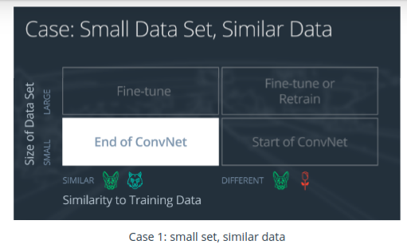
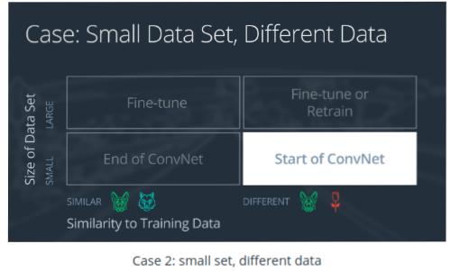
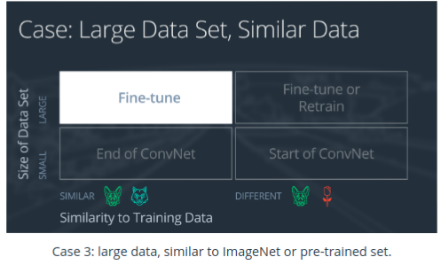
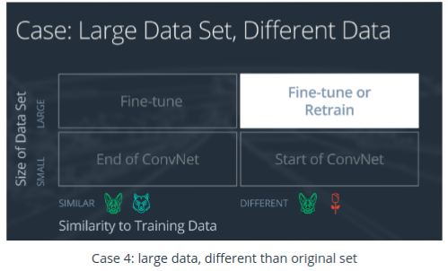

# Transfer Learning
## Overview

Transfer learning involves taking a pre-trained neural network and adapting the neural network to a new, different data set.

Depending on both:

The size of the new data set, and
The similarity of the new data set to the original data set
The approach for using transfer learning will be different. There are four main cases:

1. New data set is small, new data is similar to original training data.
2. New data set is small, new data is different from original training data.
3. New data set is large, new data is similar to original training data.
4. New data set is large, new data is different from original training data.

## Case 1: Small Data Set, Similar Data
If the new data set is small and similar to the original training data: 
</img>

1. Slice off the end of the neural network
2. Add a new fully connected layer that matches the number of classes in the new data set
3. Randomize the weights of the new fully connected layer; freeze all the weights from the pre-trained network
4. Train the network to update the weights of the new fully connected layer.

## Case 2: Small Data Set, Different Data
If the new data set is small and different from the original training data:
</img>

1. Slice off all but some of the pre-trained layers near the beginning of the network
2. Add to the remaining pre-trained layers a new fully connected layer that matches the number of classes in the new data set
3. Randomize the weights of the new fully connected layer; freeze all the weights from the pre-trained network
4. Train the network to update the weights of the new fully connected layer

## Case 3:  Large Data Set, Similar Data
If the new data set is large and similar to the original training data:
</img> 
1. Remove the last fully connected layer and replace with a layer matching the number of classes in the new data set
2. Randomly initialize the weights in the new fully connected layer
3. Initialize the rest of the weights using the pre-trained weights
4. Re-train the entire neural network

## Case 4: Large Data Set, Different Data
If the new data set is large and different from the original training data:
</img> 

1. Remove the last fully connected layer and replace with a layer matching the number of classes in the new data set
2. Retrain the network from scratch with randomly initialized weights
3. Alternatively, you could just use the same strategy as the "large and similar" data case

