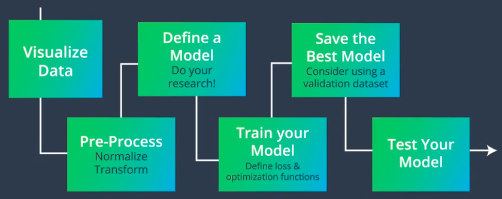

# Convolution Neural Networks

## Image Classification Pipeline 
</img>

## MLPs v/s CNNs
| MLP                             | CNN                                                     |
|---------------------------------|---------------------------------------------------------|
| Only use fully-connected layers | Makes use of fully as well as sparsely connected layers |
| Only accepts vector as input    | Also accepts matrices as input                          |

### MLPs 
In a MLP, every hidden node needs to be connected to every pixel in input image. This accounts for a lot of redundancy. 
</img>
