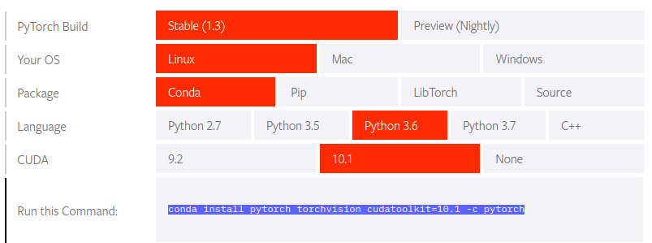

<p align="center"></p>

--------------------------------------------------------------------------------

This repository provides tutorial code for deep learning researchers to learn [PyTorch](https://github.com/pytorch/pytorch). My reference for this repository's content is from [Udacity's Bertelsmann Scholarship for AI track](https://www.udacity.com/bertelsmann-tech-scholarships). Before starting this tutorial, it is recommended to finish [Official Pytorch Tutorial](http://pytorch.org/tutorials/beginner/deep_learning_60min_blitz.html).


<br/>

## Get Started Locally

### Install Jupyter Notebook
```
conda install numpy jupyter notebook
```
If you haven't used conda before, please read the [documentation](https://conda.io/en/latest/) to learn how to create environments and install packages. I suggest installing Miniconda instead of the whole Anaconda distribution. The normal package manager pip also works well. 

### Install Pytorch

The easiest way to install PyTorch and torchvision locally is by following the instructions on the [PyTorch site](https://pytorch.org/get-started/locally/). <br>


```
conda install pytorch torchvision cudatoolkit=10.1 -c pytorch
```

### Verification 
To ensure that PyTorch was installed correctly, we can verify the installation by running sample PyTorch code. 

