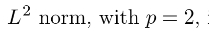

# Linear Algebra

# Scalars, Vectors, Matrices and Tensors

## Scalars
* single number 
* write scalar in *italics*
* E.g. *Let s ∈ R be the slope of the line*

## Vectors 
* Array of numbers
* Identifying points in space, with each element giving the coordinate along a different axis.

## Matrices
* 2-D Array of numbers
* uppercase, bold-face e.g. **A**

### Properties of Matrices and Vectors -

|

| S.No | Matrix/Vector Property                     | Description                                                                           |
|------|-------------------------------------|---------------------------------------------------------------------------------------|
| 1.   | Transpose of Matrix                 |                                                                                       |
| 2.   | Matrix Addition                     |                                                                                       |
| 3.   | Matrix Multiplication               |                                                                                       |
| 4.   | Transpose of Matrix Product         |                                                                                       |
| 5.   | Identity Matrix                     |                                                                                       |
| 6.   | Inverse Matrix                      |                                                                                       |
| 7.   | Linear Combination of vectors       |                                                                                       |
| 8.   | Span of set of vectors              |                                                                                       |
| 9.   | Linearly Indipendent set of vectors | If no vector is linear combination of other vectors in the set;                        |
| 10.  | Square Matrix                       | Equal no. of rows and columns                                         |
| 11.  | Left/Right Inverse                  | For square matrix, left inverse = right inverse                                       |
| 12.  | Norms                               | Determines size of vector;                                                              |
| 13.  | Properties of Norms                 |                                                                                       |
| 14.  | Euclidean Norm                      |                                                                                       |
| 15.  | L1 Norm                             | Determines diff. between elements that are exactly 0 and elements that are close to 0;  |
| 16.  | Max Norm                            |                                                                                       |
| 17.  | Frobenius Norm                      | Measures size of matrix. (Analogus to euclidean-norm)                                 |
| 18.  | Dot product of vectors (x, y)       |                                                                                       |
| 19.  | Diagnol Matrix                      |                                                                                       |
| 20.  | Identity Matrix                     | Matrix whose diagnol enteries are 1                                                   |
| 21.  | Symmetric Matrix                    |                                                                                       |
| 22.  | Unit Vector                         |                                                                                       |
| 23.  | Orthogonal Vectors                  |                                                                                       |
| 24.  | Orthonormal Vectors                 | Orthogonal vectors with unit norm;                                                      |
| 25.  | Orthogonal Matrix                   | Square matrix with rows and columns orthonormal respectively.                         |

