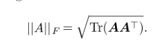

# Linear Algebra

Table of Contents
=====================
* [Scalars, Vectors, Matrices and Tensors](Scalars,-Vectors,-Matrices-and-Tensors)
  * [Scalars](Scalars)
  * [Vectors](Vectors)
  * [Matrices](Matrices)
    * [Properties of Matrices and Vectors](Properties-of-Matrices-and-Vectors)
* [Matrix Decomposition](Matrix-Decomposition)
  * [Eigen Decomposition](Eigen-Decomposition)
  * [Single Value Decomposition](Single-Value-Decomposition)
  * [Moore-Penrose Pseudoinverse](Moore-Penrose-Pseudoinverse)
* [Trace Operator](Trace-Operator)
  

# Scalars, Vectors, Matrices and Tensors

## Scalars
* single number 
* write scalar in *italics*
* E.g. *Let s ∈ R be the slope of the line*

## Vectors 
* Array of numbers
* Identifying points in space, with each element giving the coordinate along a different axis.

## Matrices
* 2-D Array of numbers
* uppercase, bold-face e.g. **A**

### Properties of Matrices and Vectors

| S.No | Matrix/Vector Property                     | Description                                                                           |
|------|-------------------------------------|---------------------------------------------------------------------------------------|
| 1.   | **Transpose of Matrix**                 |                                                                                       |
| 2.   | **Matrix Addition**                     |                                                                                       |
| 3.   | **Matrix Multiplication**               |                                                                                       |
| 4.   | **Transpose of Matrix Product**         |                                                                                       |
| 5.   | **Identity Matrix**                     |                                                                                       |
| 6.   | **Inverse Matrix**                      |                                                                                       |
| 7.   | **Linear Combination of vectors**       |                                                                                       |
| 8.   | **Span of set of vectors**              |                                                                                       |
| 9.   | **Linearly Indipendent set of vectors** | If **no vector is linear combination** of other vectors in the set;                        |
| 10.  | **Square Matrix**                       | Equal no. of rows and columns                                         |
| 11.  | **Left/Right Inverse**                  | For square matrix, **left inverse = right inverse**                                       |
| 12.  | **Norms**                               | Determines **size of vector**;                                                              |
| 13.  | **Properties of Norms (function *f*)**                 |                                                                                       |
| 14.  | **Euclidean Norm**                      |                                                                                       |
| 15.  | **L1 Norm**                             | Determines diff. between elements that are exactly 0 and elements that are close to 0;  |
| 16.  | **Max Norm**                            |                                                                                       |
| 17.  | **Frobenius Norm**                     | Measures **size of matrix**. (Analogus to euclidean-norm)                                 |
| 18.  | **Dot product of vectors (x, y)**       |                                                                                       |
| 19.  | **Diagnol Matrix**                      |                                                                                       |
| 20.  | **Identity Matrix**                     | Matrix whose diagnol enteries are 1                                                   |
| 21.  | **Symmetric Matrix**                    |                                                                                       |
| 22.  | **Unit Vector**                         |                                                                                       |
| 23.  | **Orthogonal Vectors**                  |                                                                                       |
| 24.  | **Orthonormal Vectors**                 | **Orthogonal** vectors with **unit norm**;                                                      |
| 25.  | **Orthogonal Matrix**                   | Square matrix with rows and columns **orthonormal respectively**.                         |

# Matrix Decomposition
## Eigen Decomposition
**Eigendecomposition** is a way of **breaking/decomposing** matrix into smaller matrices (analogus to *prime factorization*). 
 
**Eigen Vector* is a non-zero vector ***v***, which upon being multiplied by matrix **A**, alters only the scale of ***v***. 
 
Below figure shows before and after multiplying *eigen vector* with *eigen value* : 
 

* Matrix whose all eigen values are -
  * positive is called **positive definite**
  * positive or zero-valued is called **positive semi-definite**
  * negative is called **negative definite**
  * negative or zero-valued is called **negative semi-definite**

## Single Value Decomposition
SVD factorizes matrix into singular values and singular vectors. In SVD, matrix **A** can be decomposed as follows -  

### Properties - 
* **A** - (m, n) matrix
* **U** - (m, m) orthogonal matrix, columns of **U** are called **left-singular vectors**
* **D** - (m, n) diagnol matrix, not necessarily square, elements along diagnol **D** are called **singular values of A** 
* **V** - (n, n) orthogonal matrix, columns of **V** are called **right-singular vectors**

## Moore-Penrose Pseudoinverse
Usually matrix inversion is not possible for non-square matrices. To solve below linear equation, in case **A is non-square matrix** , we use Moore-Penrose pseudoinverse formula to **find solution to x** -  
 
 
Here, **U, D, V** are SVD of **A**.  
*Pseudo-inverse of **D** is obtained by* - 
* take reciprocal of non-zero elements 
* take transpose of resultant matrix

# Trace Operator
* Gives **sum of diagnol enetries** of matrix. 

* **Frobenius norm** can be re-written in terms of Trace operator as follows -

* **Properties of Trace operator** -
  1.  
  2. 
