# Probability and Information Theorey

# Overview
* Probability provides means to quantify uncertainity.
* Probability is used for 2 reasons in AI -
  * Model explaiability
  * Behaviour analysis of AI model

# Definitions and Formulas

| S.No. | Term/Formula                                        | Description                                                                                                                                                                                                               |
|-------|-----------------------------------------------------|---------------------------------------------------------------------------------------------------------------------------------------------------------------------------------------------------------------------------|
| 1.    | **Random Variable**                                     |Variable that can take **different values randomly**.  **Discrete Random Variable** has finite/counatably infinite states. **Continous Random Variable** is associated with real value                                                 |
| 2.    | **Probability Distributions**                           | Describes how likely a **random variable takes each of its possible states**                                                                                                                                                  |
| 3.    | **Probability Mass Function  (PMF)**; *P(x)*             | Probability distributions over **discrete variables**.  Mapping from **state** of random variable to **probability** of that variable taking that state.                                                                              |
| 4.    | **Joint Probability  Distribution**, *P(X=x, Y=y)*        | Probability distribution over **different variables** at the same time. 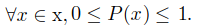                                                                                                                                                       |
| 5.    | **Properties of Joint Probability Distribution**        |Domain of P must be all possible states of x. 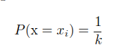                                                                                                                                                                          |
| 6.    | **Uniform Distribution**                                |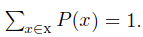                                                                                                                                                                                                                           |
| 7.    | **Probability Distribution Function**                   |PMF for continous variables.                                                                                                                                                                                          |
| 8.    | **PDF** :: *x lies between [a, b]*                         |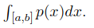                                                                                                                                                                                                                           |
| 9.    | **Marginal Probability**                                |Probability **distribution over subset**. 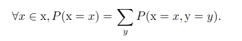 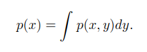                                                                                                                                                                                     |
| 10.   | **Conditional Probability**                             |**Probability** of an event, **given some other event** has already happened. **Conditional Probability** valid only when **P(X=x)>0**.                                                                                                 |
| 11.   | **Chain Rule for Conditional  Probability**             |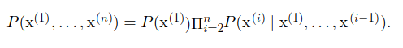                                                                                                                                                                                                                           |
| 12.   | **Indipendence Rule**                                   |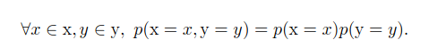                                                                                                                                                                                                                           |
| 13.   | **Conditional Indipendence**                            |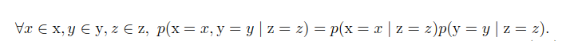                                                                                                                                                                                                                           |
| 14.   | **Expectation**                                         |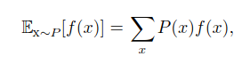 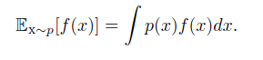 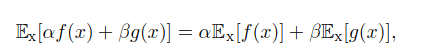                                                                                                                                                                                                                            |
| 15.   | **Variance**                                            |Measures how much **values of function of random variable x vary** as we sample different values of x. 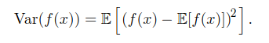                                                                                                                       |
| 16.   | **Standard Deviation**                                  | Square root of **Variance**.                                                                                                                                                                                                                           |
| 17.   | **Co-variance**                                         |Sense of **how much 2 variables are linearly related** to each other. 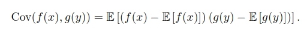                                                                                                                                                        |
| 18.   | **Properties of  Co-variance**                          |co-variance == 0 => indipendent variables co-variance != 0 => dependent variables                                                                                                                                     |
| 19.   | **Co-variance matrix**                                  |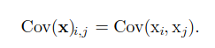 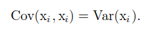                                                                                                                                                                                                                           |
| 20.   | **Bernoulli Distribution**                              |Distribution over **single binary random variable**.  Gives probability of random variable being equal to 1. 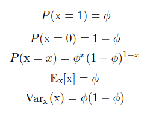                                                                                                                |
| 21.   | **Multinoulli Distribution**                            |Distribution over **single binary random variable with k(finite) different states.** 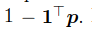 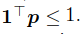                                                                                                                                        |
| 22.   | **Gaussian (Normal) Distribution**                      |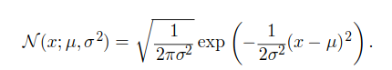 Parameters **controlling normal distribution** :   **u** gives coordinates of **central peak**                                                                                                                                     |
| 23.   | **Precision (Inverse Variance)**                        |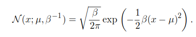                                                                                                                                                                                                                           |
| 24.   | **Standard Normal Distribution**                        |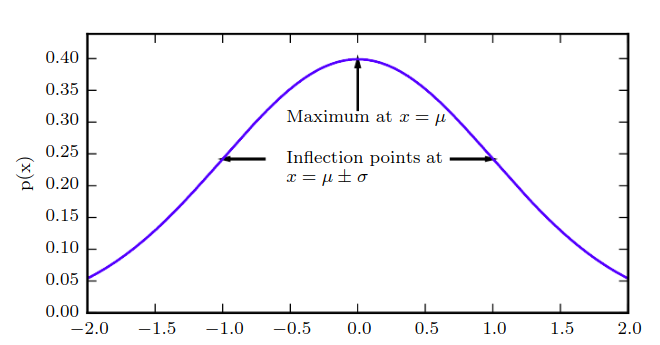                                                                                                                                                                                                                           |
| 25.   | **Central Limit Theorem**                               |Sum of **indipendent random variables** is approximately normal distributed.                                                                                                                                                  |
| 26.   | **Why Normal Distribution is a better default choice?** |**Central Limit theorem**; complicated systems can be modelled as normally distribued  noise. It encodes **maximum amount of uncertainity** over real numbers                                                                  |
| 27.   | **Multivariate Normal Distribution**                    |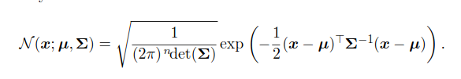 ∑ gives **co-variance distribution**.                                                                                                                                                                                        |
| 28.   | **Precision Matrix**                                    |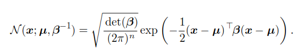                                                                                                                                                                                                                           |
| 29.   | **Exponential Distribution**                            |To achieve **probability distribution with sharp point** at x=0. 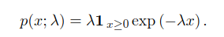 Uses Indicator fucntion, to assign probability 0, to all -ve numbers. 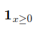                                                                                      |
| 30.   | **Laplace Distribution**                                |Places **sharp peak of probability mass** at any **arbitrary** point u. 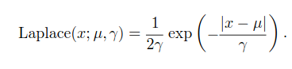                                                                                                                                                         |
| 31.   | **Dirac Distribution**                                  |Specifies **all mass in probability distribution** cluster around **single point**. **Zero** valued everywhere, except 0, yet integrates to 1. Generalized function that puts **less density on all points other than 0.** 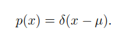           |
| 32.   | **Emperical Distribution**                              |Puts probability **mass of (1/m)** on each masses. 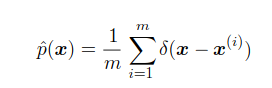                                                                                                                                                                          |
| 33.   | **Mixture of Distributions**                            |On each trial, **choice of which component distribution** should generate sample by  generating component identity from **multinouli distribution**- 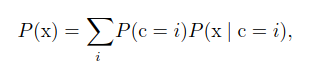                                                                           |

| S.No. | Term/Formula             | Description                                                                                                                                                                                                               |
|-------|--------------------------|---------------------------------------------------------------------------------------------------------------------------------------------------------------------------------------------------------------------------|
| 33.   | Mixture of Distributions | * On each trial, choice of which component distribution should generate sample by  generating component identity from multinouli distribution -                                                                           |
| 34.   | Gaussian Mixture Model   | * Each component has separately parameterized mean and co-variance. * Components ,, are Gaussians * Specifies prior probability,, given to each component i. * Expresses model's belief about c, before it has observed x |
| 35.   | Posterior Probability    | * Probability is computed after observation of x.                                                                                                                                                                         |
| 36.   | Universal Approximator   | * Any smooth density can be approximated with any specific nonzero amount of error  by Gaussian mixture model with enough components.                                                                                     |
| 37.   | Logistic Sigmoid         | * Produces phi paramter of Bernoulli distribution * Range - (0,1)                                                                                                                                                         |
| 38.   | Softplus Function        | * Produces B or A paramters of Normal distribution. * Range - (0, infinity)                                                                                                                                               |
| 39.   | Properties of Softplus   |                                                                                                                                                                                                                           |
| 40.   | Baye's Rule              |                                                                                                                                                                                                                           |
| 41.   | Measure Zero             | * Rigrous way of describing that set of points is negligibly small. * Set of measure 0 occupies no volume in space we are measuring                                                                                       |
| 42.   | Almost Everywhere        | * Property that holds almost everywhere holds throughout all space except for on the set of measure 0.                                                                                                                    |

