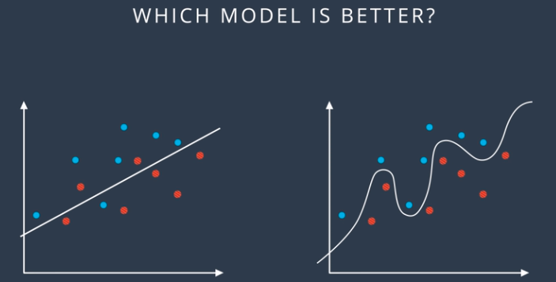
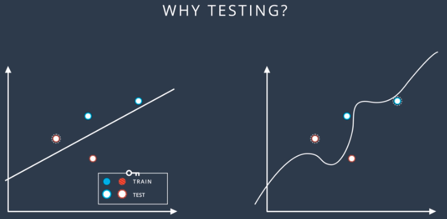
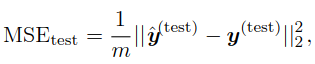
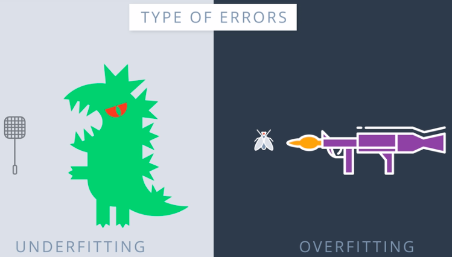
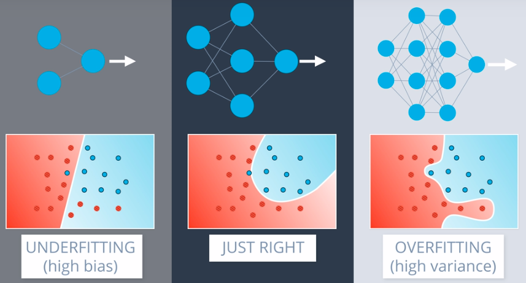

Table of Contents
====================
* [Machine Learning Basics](#Machine-Learning-Basics)
* [Learning Algorithms](#Learning-Algorithms)
   * [Linear Regression](#Linear-Regression)
* [Capacity, Overfitting and Underfitting](#Capacity,-Overfitting-and-Underfitting)
* [Hyperparameters and Validation Sets](#Hyperparameters-and-Validation-Sets)
* [Estimators, Bias, Variance](#Estimators,-Bias,-Variance)
   * [Estimators](#Estimators)
        * [Point Estimator](#Point-Estimator)
        * [Function Estimator](#Function-Estimator)
    * [Bias](#Bias)
    * [Variance and Standard Error](#Variance-and-Standard-Error)
    * [Trading off Bias and Variance to MSE](#Trading-off-Bias-and-Variance-to-MSE)
    * [Consistency](#Consistency)
    * [Maximum Likelihood Estimation](#Maximum-Likelihood-Estimation)
         * [Conditional Log-Likelihood and Mean Squared Error](#Conditional-Log-Likelihood-and-Mean-Squared-Error) 
         * [Properties of Maximum Likelihood Estimatior](#Properties-of-Maximum-Likelihood-Estimatior)
    * [Bayesian Statistics](#Bayesian-Statistics)
    * [Maximum a Posteriori (MAP) Estimation](#Maximum-a-Posteriori-(MAP)-Estimation)
 * [Supervised Learning Algorithms](#Supervised-Learning-Algorithms)
    * [Probabilistic Supervised Learning](#Probabilistic-Supervised-Learning)
    * [Support Vector Machines](#Support-Vector-Machines)
        * [Kernels](#Kernels)
        * [Advantages/Disadvantages of Kernel](#Advantages/Disadvantages-of-Kernel)
* [Unsupervised Learning Algorithms](#Unsupervised-Learning-Algorithms)
    * [Principal Component Analysis (PCA)](#Principal-Component-Analysis-(PCA))
 
    

# Machine Learning Basics 
Machine learning isessentially a form of applied statistics with increased emphasis on the use ofcomputers to statistically estimate complicated functions and a decreased emphasison proving confidence intervals around these functions

# Learning Algorithms
A computer program is said to learn from **experience E** with respect to some class of **tasks T** and **performance measure P**, if its **performance** at tasks in T, as measured by P, improves with experience E. 

| Term                   | Description                                                                                                                                                                                                                                                                                                                                                                                                                                                   |
|------------------------|---------------------------------------------------------------------------------------------------------------------------------------------------------------------------------------------------------------------------------------------------------------------------------------------------------------------------------------------------------------------------------------------------------------------------------------------------------------|
| **Task, T**                | ML tasks are described in terms of how **ML system should process an example**.  **Example** is collection of **features** , quantitatively measured from event that ML model will process.  1. **Classification**-which of the *k* categories, input belongs to?  2. **Classification with missing inputs** - ML model defines *single function mapping* from vector to categorical input.  3. **Regression** - Predict output, given some input.   |
| **Perfomance Pressure, P** | 1. Measure *accuracy, error-rate* of model.  2. Evaluate P, using *test-set* (completely separate from *train-set*).                                                                                                                                                                                                                                                                                                                                    |
| **Experience, E**          | 1. Based on E, ML algorithms are classified as *unsupervised* and *supervised* learning algos.                                                                                                                                                                                                                                                                                                                                                                |

## Training and Testing Data
Consider the below scenario where on the left we have a simple solution to classify 2 categories of points. The second solution is a bit complex as compared to first one. Now, which one is a better solution?  
</img>  
We classify our data into 2 types - training and testing data. 
We calculate and predict the line of classification using training data (without looking at testing data.) Now we see how well our prediction has performed on testing data. The dots with white inside are testing data.  
</img>  
Looking at the scenario above, it is clear that the first solution is a better one since it classified more data points correctly.

## Linear Regression
* **Goal :** Build a system that takes vector **x є R**, and predict value of scalar **y є R** as output. Output can be defined as follows, where **b** is the intercept term - 
 
* Term **b**, is often called **bias parameter,** in the sense that o/p of transformation is *biased towards being b*, in absence of any input. 
* **w є R** is set of **vectpr parameters/weights** that determines how each feature affects prediction.
* Model's performance can be measured on the basis of **Mean Squared Error (MSE)** on *test-set*. 
 
* Improve ML model, by improving **w** such that it **reduces *MSE(test)***, by observing training set,   
* To get **optimum weight, w value**, minimize MSE(train), i.e. solve for where its **gradient = 0** (system of **Normal Equations.**). .
 
 

# Capacity, Overfitting and Underfitting
Consider the following scenario to understand overfitting and underfitting -  
*Scenario 1:* Trying to kill Godzilla using fly-trap => Here we are over-simplifying the problem. This is called **underfitting** 
*Scenario 2:* Trying to kill fly using Bazooka. => Here we are over-complicating the solution which will lead to bad results. This is known as **overfitting**   
</img>  

In terms of neural networks, overfitting and underfitting can be classified as follows -   
</img>  

* **Generalization -** Ability to perform on previously unobserved inputs.
* **Generalization/Test-Error** - Expected value of error on new input.
* To improve model's performance, reduce **test-error.** Test error can be defined as follows -  
* Set of **i.i.d assumptions** describes data-generating process with probability distribution over single sample.
* **i.i.d** assumptions refers to examples in each data-set are **indipendent** and training and test data are **identically distributed.**
* Expected training error of random model equals expected testing error of that model.
* Factors that determine how well ML model will perform are - 
    * smaller training error
    * smaller gap between training and testing error
* **Underfitting** - model's inability to achieve smaller training error.
* **Overfitting** - gap between training and testing error is too large.
* **Capacity** - model's capacity is its ability to fit a wide variety of functions.
* **Hypothesis space** - set of functions that the learning algorithm is allowed to select as being the solution.
* ML algos perform best when their capacity is appropriate for the true complexity of the task.
* **Representational Capacity** - ( choice of model + hypothetical space)
* **Effective Capacity <= Representational Capacity** 
 

* **Baeys Error** - difference between true probability distribution and true probability distribution.
* **No Free Lunch Theorem** - ML aims to find rules that are **probably correct** about **most** members of the set rather than finding rules that are surely correct about certain set of members. 
Theorem states that averaged over all possible data sets, **no ML algorithm is universally any better than other**.

* **Weight Decay -** ML algos are given preference in **hypothesis space.** We can transform linear regression to include weight decay. The criterion *J(**w**)*, has preference for weights with smaller **L2 norm** 
 
   * λ is a value chosen ahead of time that controls the strength of our preference for smaller weights.
   * λ= 0, we impose no preference
   * larger λ forces weights to become smaller.
   * In general, *we can regularize a model that learns a **functionf(x;θ)** by adding a penalty called **regularizer** to cost function.*
   
* **Regularization** is any modification we make to learning algorithm that is intended to **reduce its generalization error** but not training error.

# Hyperparameters and Validation Sets

*  **Hyper-parameters -** 
      * Settings related to ML algos that can be used to control algorithm’s behavior.
      * Sometimes settings is chosen as hyper-paramter, because it is **not appropriate to learn that hyperparameter**               (controlling model's capacity) on the training set, since they would always **chose maximum possible model                   capacity**,resulting in **overfitting**.
     
     
* **Validation-set -**
      * To solve the above problem of overfitting due to chosing of maximum model's capacity, we need set of examples that model has not observed. This set is called *validation-set (constructed from training data).*
      
# Estimators, Bias, Variance
## Estimators 

### Point Estimator 
* Point estimation is the attempt to provide the single **best** prediction of some quantity of interest.
* Point estimation for θ is represented by ˆθ. 
 
* A good estimator is a function, whose output is close to true value θ that generated training data.

### Function Estimator
 
* In function estimation,approximate f with a model or estimateˆf.
* Function estimator **ˆf** is simply a point estimator in **function space**.

## Bias
* Bias of an estimator is defined as - 
 
* Estimator ˆθm is said to be unbiased if bias(ˆθm) =0
* An estimatorˆθmis said to be **asymptotically unbiased** if 
 
* **Gaussian and Bernoulli distribution are unbiased.**
* **Variance of Gaussian distribution** is biased with bias of   

## Variance and Standard Error

* **Variance/Standard Error**  of an estimator provides a measure of how we would expect the estimate we compute from data to vary as we independently resample the dataset from the underlying data-generating process.
* **Lower** the variance, the better.
* **Standard Limit Theorem** - Mean will be approximately distributed with a normal distribution.
* Variance of an estimator is given by - 
 

## Trading off Bias and Variance to MSE
* To chose between 2 estimators (more variance or more bias), we negotiate this trade-off by using **cross-validation**.
* MSE in terms of **variance and bias** is given by - 
 

* Increasing capacity -> Increased variance, decreased bias.
* Relationship between **bias, variance, capacity and generalization error** is given as follows - 
 

## Consistency
* As the number of data points (*m*) increases in data-set, we expect our point estimates converge to the true value of the corresponding parameters. 
 

* Consistency ensures that the **bias** induced by the estimator **diminishes** as the number of data examples grows.

## Maximum Likelihood Estimation
Rather than guessing that some function might make a good estimator and then analyzing its bias and variance,we would like to have some **principle from which we can derive specific functions that are good estimators for different models**.

* Maximum likelihood estimator for θ is then defined as - 
 

* Taking *log* both sides and dividing by *m* to convert it into *expectation*, we get - 
 

* Maximum likelihood can be seen as minimizing **dissimilarity** between the **empirical distribution** ˆpdata, defined by the training set and **model distribution**. 
   * **KL Divergence** measures degree of dissimilarity between the two.
   * **Minimizing KL divergence** implies minimizing **cross-entropy** between distributions.
   
### Conditional Log-Likelihood and Mean Squared Error
If ***X*** represents all our inputs and ***Y*** all our observed targets, then the **conditional maximum likelihood estimator** is gven by, assuming examples are i.i.d - 
 

### Properties of Maximum Likelihood Estimatior 
Under appropriate conditions, the maximum likelihood estimator has the **property of consistency**, given the following conditions -
   * The true distribution **pdata** must lie within the model family **pmodel(·;θ)**
   * The true distribution **pdata** must correspond to **exactly one value** of θ.

* **Statistical Efficiency**
Consistent estimator may obtain **lower generalization error** for a fixed number of samples ***m***, or equivalently, may require **fewer examples to obtain a fixed level of generalization error.**

# Bayesian Statistics
Till now, we have considered **single estimated value of θ** and made **all predictions**. Another approach is to consider **all values of θ** and make **one single prediction**. The later domain is known as ***Bayesian Statistics.***

* The Bayesian uses **probability** to reflect **degrees of certainty** in states of knowledge.

* Considering we have set of examples </img>, we can recover the effect of data on our belief about θ by combining the data likelihood, </img>, with the prior via Bayes’ rule - 
</img> 

* **Maximum likelihood approach** addresses the **uncertainty** in a given point estimate of **θ** by evaluating its **variance**. 
**Bayesian statistics integrates** over point estimate to address uncertainity.

* The **prior** has an influence by **shifting probability mass density** towards regions of the parameter space that are **preferred a priori**.

* Bayesian statistics suffer **high computational costs** when training examples are **large**.

# Maximum a Posteriori (MAP) Estimation
* Rather than simply returning to the maximum likelihood estimate, we can still gain some benefit of Bayesian approach by allowing the **prior to influence the choice of the point estimate**. 
* One rational way to do this is to choose **maximum a posteriori(MAP) point estimate**, which choses the point of **maximal probability density in the more common case of continuous θ**- 
</img>

* **MAP Bayesian inference** provides a straightforward way to design complicated yet **interpretable regularization terms**.

# Supervised Learning Algorithms
 Supervised learning algorithms are learning algorithms that learn to associate some input with some output, given a training set of examples of ***inputs x and outputs y***.
 
 ## Probabilistic Supervised Learning
 * Supervised learning is based on estimating probability distribution </img>, by using **maximum likelihood estimation** to find the best parameter vector **θ** for a parametric family of distributions **p(y | x; θ)**
 
 * ***Logistic Regression -***
   * Normal distribution over **real-valued** numbers, used for **linear regression** is parametrized in terms of **mean**.
    </img>
   * Distribution for **binary variables** becomes complicated since mean must always be between **0 and 1.**
   * Above problem can be solved by using **logistic sigmoid function**, to squash output of linear function into interval        (0, 1) and interpret that value as a probability: 
   </img>
   
  ## Support Vector Machines
  
* Most influential approach to supervised learning problems.
* Similar to **logistic regression** and driven by a linear function
   </img>
* Donot provide probabilities, predicts presence of positive or negative class.

### Kernels
* Many machine learning algorithms can be written exclusively in terms of **dot products between examples.**
* Linear function used by SVM can be rewritten as  
   </img>
   * x(i) is *training example* and α is *vector of coefficients.*
   * This replaces *x* with output of given a given feature function **φ(x)** 
* The **dot product**   </img>  is called **kernel.**
* Dot operator is analogus to </img>
* **Predictions** are made using the function - 
</img>

#### Advantages/Disadvantages of Kernel
* Enables us to learn models that are **nonlinear** as a function of **x** using **convex optimization techniques.**
* Kernel function **k** is **computationally efficient** than naively constructing 2 φ(x) vectors and explicitly taking their dot product.
* **Cost of evaluationg** a Kernel function is very high since *i-th example* contributes a term </img> to decision function.
* SVMs are able to mitigate the above problem by learning an **α vector** that contains **mostly zeros.**
* Classifying a new example then requires evaluating the kernel function only for training examples that have **non-zero αi.** Such training examples are called **Support Vectors**

# Unsupervised Learning Algorithms
* ALgorithms that experience only **features but not a supervision signal**.
## Principal Component Analysis (PCA)
* PCA is unsupervised learning algorithm that **learns representation of data**.
* PCA is then used for **dimensionality reduction** preserving as much information about data as possible.
* Assuming a *m by n design matrix* ***X***. and has a 0 mean.
* **Unbiased sample covariance** matrix is given by -
</img>
* PCA finds **representation** through linear transformation via </img>
* Principals components of design matrix are given by **eigen vectors of** </img>
* Principals components can be obtained by **SVD** also; Let **W** be right singular vectors in the decomposition </img>. Original eigen vector can be recovered by - 
</img>.
* Variance of **X** can be now expressed as - 
</img>.
* Co-variance of **z** is diagnol - 
</img> 
</img>
