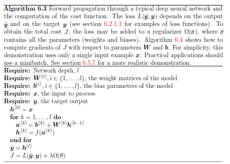
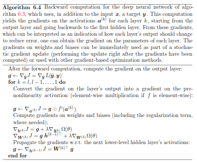
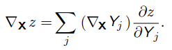

# Back Propagation and Other Differentiation Algorithms
- [Overview](#overview)
- [Computational Graphs](#computational-graphs)
- [Chain Rules of Calculus](#chain-rules-of-calculus)
- [Recursively Applying the Chain Rule to Obtain Backprop](#recursively-applying-the-chain-rule-to-obtain-backprop)
- [Difference between Feed-Forward and Back-Propagation](#difference-between-feed-forward-and-back-propagation)
- [General Back Propagation Algorithm](#general-back-propagation-algorithm)
  * [Main Functions involved in Back-Propagation](#main-functions-involved-in-back-propagation)

## Overview
* A **feedforward neural network** accepts **input x** and produces **output y**, information **flows forward** through the network. The input **x** provides initial information which propagates through **hidden units and finally produces y**. This is called **forward propagation**. 
* **Back-propagation algorithm (backprop)**, allows the information from the **cost to then flow backward through network** in order to **compute gradient**.

* Numerically evaluating analytical expression for **gradient** can be very expensive.

## Computational Graphs

* Computational graphs are used to describe **back-propagation algorithms more precisely.**
* Each **node** describes a **variable**
* Graphs are accompanied by **operations**, which is a simple **function of one or more variables.**
* If a **variable y** is computed by applying an **operation to a variable x**, then we draw a **directed edge from x to y**. 
</img>

## Chain Rules of Calculus
* Suppose that **x ∈ Rm**, **y ∈ Rn** ,g **maps from Rm to Rn**, and f **maps from Rn to R**. 
* If **y=g(x) and z=f(y)** then ***chain rule of calculus states that***- 
</img>
* Equivalent **vector notion can be stated as -** 
</img> 
</img> 

* **Gradient of a variable x** can be obtained by multiplying **Jacobian matrix ∂y/∂x by a gradient ∇yz**.
* Back-propagation algorithm consists of performing **Jacobian-gradient product for each operation in the graph.**

## Recursively Applying the Chain Rule to Obtain Backprop
* Any procedure that **computes the gradient** will need to choose whether to **store sub expressions or to recompute them several times**. 
</img> 
* Eqution (1) suggests an implementation in which computes **f(w) only once and store it in the variable x**. Used when **memory is low.**
* Equation(2) **re-computes value of f(w)**  each time it is needed. Used when **memory is limited.**
* **Amount of computation** required for performing back-propagation **scales linearly with #edges in G**. 
     * Computation for **each edge** corresponds to computing a **partial derivative** (of one node with respect to one of its parents) as well as **performing one multiplication and one addition.**

* Back-propagation algorithm is designed to **reduce number of common subexpressions** without regard to memory.
* Backprop performs on the order of **one Jacobian product per node in the graph.**

## Difference between Feed-Forward and Back-Propagation
</img>
</img>

## General Back Propagation Algorithm
* Compute **gradient** of some **scalar z w.r.t one of its ancestors x** in the graph.
* Then compute **gradient w.r.t each parent of z** in graph by **multiplying current gradient by Jacobian of operation that produced z.**
* Continue **multiplying by Jacobians**, traveling backward through the graph **until x is reached.**
* For any node that may be reached by **going backward from z through two or more paths**, **sum the gradients arriving from different paths at that node.**

### Main Functions involved in Back-Propagation
*  **get_operation(V)** : returns **operation that computes V**, represented by **edges coming into V** in computational graph.
* **get_consumers(V, G)** : returns the **list of variables that are *children* of V** in the computational graph G.
* **get_inputs(V, G)** : returns the **list of variables that are *parents* of V** in the computational graph G.
* Each operation ***op*** is associated with ***bprop*** that computes **Jacobian-vector product** as follows - 
</img>
* Below is an example demonstrating ***op.bprop***
    * if **mul operator** is passed two copies of x to **compute x2**, **op.bprop** method should still return **x as derivative w.r.t both inputs**. 
    * Back-propagation algorithm will later **add both of these arguments together to obtain 2x**, which is the correct total derivative on x
* For the MLP, the **computational cost is dominated by cost of matrix multiplication**.

