**Table of Contents**
======================
- [Deep Forward Networks](#deep-forward-networks)
- [Overview](#overview)
- [Rectified Linear Unit Activation Function ](#Rectified-Linear-Unit-Activation-Function)
  * [Problem Statement](#problem-statement)
  * [Linear Model Approach](#linear-model-approach)
  * [Non-Linear Model Approach](#non-linear-model-approach)
- [Gradient Based Learning](#gradient-based-learning)
  * [Cost Functions](#cost-functions)
    + [Conditional Statistics](#conditional-statistics)
  * [Output Units](#output-units)
    + [Linear Units for Gaussian Output Distributions](#linear-units-for-gaussian-output-distributions)
    + [Sigmoid Units for Bernoulli Output Distributions](#sigmoid-units-for-bernoulli-output-distributions)
    + [Softmax Units for Multinoulli Output Distributions](#softmax-units-for-multinoulli-output-distributions)
  * [Hidden Units](#hidden-units)
    + [Rectified Linear Units](#Rectified-Linear-Units)
    + [ReLU's Generalization](#ReLU-s-generalization)
    + [Logistic Sigmoid and Hyperbolic Tangent](#logistic-sigmoid-and-hyperbolic-tangent)
- [Architecture Design](#architecture-design)
  * [Universal Approximation Properties and Depths](#universal-approximation-properties-and-depths)

# Deep Forward Networks

# Overview
* **Deep forward networks** also called **Multi Layer Perceptron (MLPs)** are deep learning models whose aim is to approximate some function *f* *.
* **MLP is different from classifier** as follows -
  * For **Classifier**, y=f*(x), maps input **x** to category **y**.
  * For **MLP**, y=f(x;θ) learns parameter θ that results in **best function approximation**.
  
* **They are called feed-forward because of the following information flow-** 
  `information ==> x ==> intermediate computations defining f ==> final o/p y   `
* They are called **networks** because they are **computations** of many functions.
* **Depth and Width of Network**
  * Given 3 functions, </img> connected in chain to form </img>, then </img> is called **first layer.**
  * Overall **length of chain** gives **depth** of model.
  * **Final layer** is called **Output Layer.**
  
 * **Hidden Layers and Model-Width**
    * Aim is to match f(x) with f*(x)
    * **Training examples** specify each output layer to produce value close to </img>
    * Learning algorithm makes use of above layer to **best implement approximation of f*.**
    * Since, training data **doesnot show desired o/p for each of these layers,** they are called **hidden layers.**
    * **Width of model = Dimensionality of Hidden layers.**
  
  * **Non-Linear Transformations**
    * Linear model can be extended to **non-linear functions of x** by applying linear model directly to transformed input **φ(x)**.
    * Mapping **φ** can be chosen as follows:
       * **Very generic φ** : Enough capacity, poor generalization.
       * **Manually engineered φ** : Dominant approach, takes too much time.
       * **Deep-learning of φ** : Requires learning of φ; Highly generic; Human designer finds right "general" function instead of right function. 
       
# Rectified Linear Unit Activation Function 
## Problem Statement
Our model provides a **functiony=f(x;θ)**, and **learning algorithm** will adapt **θ** to make **f similar to XOR function y =f\*(x).**

* **MSE** loss function **J(θ) -** 
</img>
* Linear model's **definition** 
</img>
* Minimizing **J(θ)** w.r.t **w** and **b** gives **w=0 and b=0.5** which is wrong.

## Linear Model Approach
* Constructing a **linear feed-forward network as below**  
</img>
* Final **complete model:** </img>
* Making </img> as linear would make **entire feed-forward network as linear.**
* Assuming **linear approach** and let </img> and </img>, in that case  </img>, which needs **non-linear functions to describe features.**

## Non-Linear Model Approach
* Most neural networks use **non-linear function** to describe features by using **affine transformation** controlled by **learned parameters**,followed by a fixed **nonlinear function** called an **activation function**.
* Affine transformation from **x to h** is defined and **activation function g** defined as:  </img>
* Recommended activation function is **ReLU**, defined as: </img> 
</img>
* Final **non-linear model** would be: 
</img>

# Gradient Based Learning
To apply gradient-based learning we must choose a **cost function**, and we must choose how to represent **output of the model**.

## Cost Functions
* Cost functions for neural networks is **approximately same as linear functions.** 
* Cost function used is **cross-entropy between training data and model's prediction.** 
</img> 
* Advantage of using maximum-likelihood for cost function is that it removes burden for designing **cost functions for each model.**
* **Gradient** of network should be **large and predictable.**
* **Saturatable functions** make **activation function small** which produces the model's output (exponent functions that saturate when their argument is negative). Solution is to use **negative logarithmic functions.**

### Conditional Statistics
* Instead of learning a **full probability distribution p(y | x;θ),** we could learn just one **conditional statistic of y given x**.
* Making cost fucntion as being **functional** rather than just **function**.
* Solving an optimization problem w.r.t function requires a mathematical tool called **calculus of variations.**
   * **Optimization Problem** 
   </img> 
   * **First result derived using calculus of variations** - predicts **mean** of y for each value of x 
   </img> 
   * **Second result derived using calculus of variations** - predicts **median** of y for each value of x, also known as **mean absolute error.** 
   </img> 
   * Mean squared error and mean absolute error lead to **poor results when used with gradient-based optimization.**

## Output Units
Choice of **cost function** is tightly coupled with **cost units**, which determines form of **cross-entropy** functions.

### Linear Units for Gaussian Output Distributions
* Linear units are **affine transformations** with **no nonlinearity.**
* Linear o/p units are used to produce **mean of Gaussian distribution**  
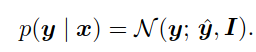</img>  where, 
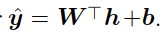</img> and **h are the features.** 
* **Maximizing log liklihood** is same as **minimizing MSE.**
* Linear units **do not saturate.**

### Sigmoid Units for Bernoulli Output Distributions
* **Classification problems with two classes** can be cast in this form.
* Maximum likelihood approach is to define a **Bernoulli distribution over y conditioned on x.**
* For Bernoulli distribution, neural net needs to predict only **P(y = 1 | x)** which should lie within interval **[0,1].**
 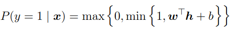</img>
* In case of **linear approach**, at anytime 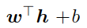</img>, strayed outside unit interval, **gradient of output = 0.**
* Better approach is to define **sigmoid function** as follows 
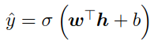</img>
* Sigmoid uses **2 layers,** where first layer computes 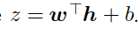</img>, next uses **sigmoid activation function** to convert z into probability.
* Below shows **Bernoulli distribution** controlled by a **sigmoidal transformation** of z. The **z variable** defining a distribution based on **exponentiation and normalization** are called **logits**: 
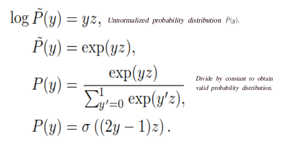</img>
* **Loss function** for maximum liklihood learning of a **Bernoulli parametrized by a sigmoid** is 
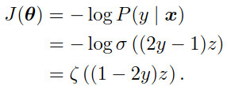</img> 
* **Saturation** occurs when **y=1 and z is very positive** or when **y=0 and z is very negative**.
* When z has the **wrong sign**, the **argument to the softplus function,(1−2y)z**, may be simplified to **|z|.**

### Softmax Units for Multinoulli Output Distributions
* **Softmax functions** are used to represent probability distributions over discrete variables with **n possible values**, unlike, **Sigmoid functions** that are used to represent probability distributions over discrete variables with **binary values.**
* Now, we need to produce vector 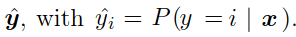</img>
* New **constraint** requires 
   * Each element of 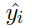</img> be b/w **0 and 1**
   * Entire vector **sums to 1**.
* Going with **linear approach** which predicts **unnormalized log probabilities**, where 
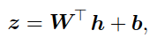</img> and  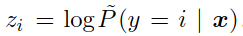</img> we want to **maximize** 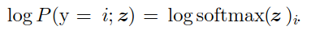</img>, therefore: 
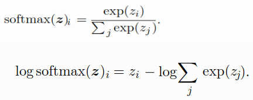</img>
* **Zi** has direct contribution to **cost-function.**
* **Zi** cannot saturate.
* **Squared error** is a **poor loss function** for softmax units.
* **Softmax functions** having multiple output values, **saturates when differences between input values become extreme.**
* More **stable variant** of softmax function can be defined as 
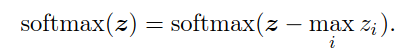</img>
* Saturation conditions 
    * 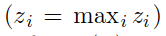</img>, softmax **saturates to 1.**
    * **zi is not maximal** and the maximum is much greater. 
    
## Hidden Units
* **ReLU** units are an excellent default choice of hidden unit.
* Some of the hidden units **might not be differentiable**, e.g. **ReLU** is not differentiable at z=0.
* A function is differentiable at **z**, iff **left and right derivative are both defined and equal** to each other.
* Most **hidden units are distinguished** from each other only by **choice of form of the activation function g(z)**.

### Rectified Linear Units 
* Activation function used by ReLU - **g(z) = max{0, z}**.
* Difference b/w **linear and rectified linear unit** is that **o/p of ReLU is 0 across half its domain.**
* **First derivative** of RelU is **1** everywhere that the unit is active, **second derivative** is **0 almost everywhere.** 
* One drawback to ReLU is that they **cannot learn via gradient-based methods** on examples for which their **activation is zero**.

### ReLU's Generalization
3 generalizations of ReLU are based on using **non-zero slope** 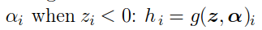</img>
* **Absolute Value Rectification**
   *  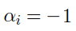</img>
   *  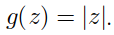</img>
   * Used for **object recognition.**
* **Leaky and Parametric ReLU**
   * **Leaky ReLU** fixes, 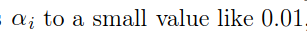</img>
   * **Parametric ReLU** (PReLU) 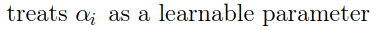</img>
* **Maxout Units**
   * Divide **z into groups of k values**
   * Each maxout unit **outputs maximum element of one of these groups** 
   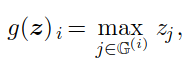</img>
   * Work well **without regularization** if - 
       * training set is large 
       * the number of pieces per unit is kept low
       
### Logistic Sigmoid and Hyperbolic Tangent
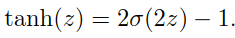</img>
* Use of **sigmoidal functions as hidden units is discouraged** due to widespread **saturation of sigmoidal functions** making gradient-based learning very difficult.
* Hyperbolic tangents **resembles identity function**, making training **tanh** network easier.

# Architecture Design
Networks are organized into groups called **layers** and are arranged in a **chain-like structure** with each layer being a function of the layer that preceded it.

## Universal Approximation Properties and Depths

 In layman's terms, **Universal Approximation Theorem** states that-
>Regardless of what **function we are trying to learn**, we know that a **large MLP** will be able to **represent this function**.  We are **not guaranteed**, however, that the training algorithm will be able to learn that function. 
 There exists a **network large enough** to achieve any **degree of accuracy** we desire, but the theorem **does not say how large** this network will be.

* Reasons as to why **learning can fail** are-
   *  Optimization algorithm used for training may **not be able to find value of parameters that corresponds to desired function**.
   * Training algorithm **might choose the wrong function** as a result of overfitting.
   
* **Conclusion ::** 

> Feedforward network with a **single layer is sufficient to represent any function**, but  layer may be infeasibly large and **may fail to learn** and generalize correctly.  In many circumstances, using **deeper models** can **reduce number of units required to represent desired function** and can reduce amount of generalization error.

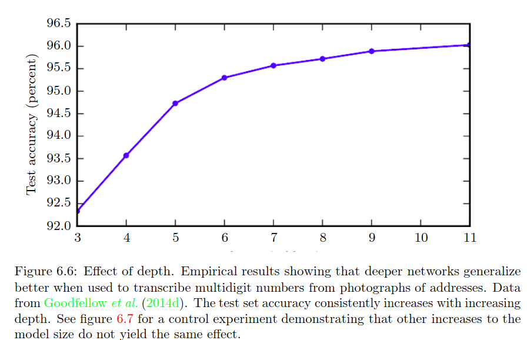</img>

