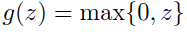

# Deep Forward Networks

# Overview
* **Deep forward networks** also called **Multi Layer Perceptron (MLPs)** are deep learning models whose aim is to approximate some function *f* *.
* **MLP is different from classifier** as follows -
  * For **Classifier**, y=f*(x), maps input **x** to category **y**.
  * For **MLP**, y=f(x;θ) learns parameter θ that results in **best function approximation**.
  
* **They are called feed-forward because of the following information flow-** 
  `information ==> x ==> intermediate computations defining f ==> final o/p y   `
* They are called **networks** because they are **computations** of many functions.
* **Depth and Width of Network**
  * Given 3 functions, </img> connected in chain to form </img>, then </img> is called **first layer.**
  * Overall **length of chain** gives **depth** of model.
  * **Final layer** is called **Output Layer.**
  
 * **Hidden Layers and Model-Width**
    * Aim is to match f(x) with f*(x)
    * **Training examples** specify each output layer to produce value close to </img>
    * Learning algorithm makes use of above layer to **best implement approximation of f*.**
    * Since, training data **doesnot show desired o/p for each of these layers,** they are called **hidden layers.**
    * **Width of model = Dimensionality of Hidden layers.**
  
  * **Non-Linear Transformations**
    * Linear model can be extended to **non-linear functions of x** by applying linear model directly to transformed input **φ(x)**.
    * Mapping **φ** can be chosen as follows:
       * **Very generic φ** : Enough capacity, poor generalization.
       * **Manually engineered φ** : Dominant approach, takes too much time.
       * **Deep-learning of φ** : Requires learning of φ; Highly generic; Human designer finds right "general" function instead of right function. 
       
# Rectified Linear Unit (ReLU) Activation Function 
## Problem Statement
Our model provides a **functiony=f(x;θ)**, and **learning algorithm** will adapt **θ** to make **f similar to XOR function y =f\*(x).**

* **MSE** loss function **J(θ) -** 
</img>
* Linear model's **definition** 
</img>
* Minimizing **J(θ)** w.r.t **w** and **b** gives **w=0 and b=0.5** which is wrong.

## Linear Model Approach
* Constructing a **linear feed-forward network as below**  
</img>
* Final **complete model:** </img>
* Making </img> as linear would make **entire feed-forward network as linear.**
* Assuming **linear approach** and let </img> and </img>, in that case  </img>, which needs **non-linear functions to describe features.**

## Non-Linear Model Approach
* Most neural networks use **non-linear function** to describe features by using **affine transformation** controlled by **learned parameters**,followed by a fixed **nonlinear function** called an **activation function**.
* Affine transformation from **x to h** is defined and **activation function g** defined as:  </img>
* Recommended activation function is **ReLU**, defined as: </img> 
</img>
* Final **non-linear model** would be: 
</img>

# Gradient Based Learning
To apply gradient-based learning we must choose a **cost function**, and we must choose how to represent **output of the model**.

## Cost Functions
* Cost functions for neural networks is **approximately same as linear functions.** 
* Cost function used is **cross-entropy between training data and model's prediction.** 
</img> 
* Advantage of using maximum-likelihood for cost function is that it removes burden for designing **cost functions for each model.**
* **Gradient** of network should be **large and predictable.**
* **Saturatable functions** make **activation function small** which produces the model's output (exponent functions that saturate when their argument is negative). Solution is to use **negative logarithmic functions.**

### Conditional Statistics
* Instead of learning a **full probability distribution p(y | x;θ),** we could learn just one **conditional statistic of y given x**.
* Making cost fucntion as being **functional** rather than just **function**.
* Solving an optimization problem w.r.t function requires a mathematical tool called **calculus of variations.**
   * **Optimization Problem** 
   </img> 
   * **First result derived using calculus of variations** - predicts **mean** of y for each value of x 
   </img> 
   * **Second result derived using calculus of variations** - predicts **median** of y for each value of x, also known as **mean absolute error.** 
   </img> 
   * Mean squared error and mean absolute error lead to **poor results when used with gradient-based optimization.**

