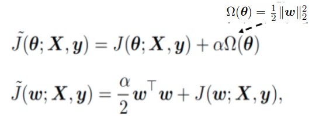

# Regularization for Deep Learning
- [Regularization for Deep Learning](#regularization-for-deep-learning)
- [Overview](#overview)
- [Bias Variance Trade-Off](#bias-variance-trade-off)
- [Strategies to make Deep Regularization Model](#strategies-to-make-deep-regularization-model)
- [Parameter Norm Penalty](#parameter-norm-penalty)
  * [Modified Objective Function](#modified-objective-function)
- [L2 Parameter Regularization](#l2-parameter-regularization)
  * [L2 norm calculation](#l2-norm-calculation)
  * [Effect of L2 Norm Paramterization](#effect-of-l2-norm-paramterization)
  * [Effect of Weight Decay](#effect-of-weight-decay)
- [L1 Norm Parameterization](#l1-norm-parameterization)
  * [L1 Norm Calculation](#l1-norm-calculation)
- [Comparing L1 and L2 Norm Parameterization](#comparing-l1-and-l2-norm-parameterization)
- [Norm Regularization without Bias](#norm-regularization-without-bias)
- [Norm Penalties as Constrained Optimization](#norm-penalties-as-constrained-optimization)
  * [Generalized Lagrange Function](#generalized-lagrange-function)
- [Explicit Constraints v/s Penalties](#explicit-constraints-v/s-penalties)
- [Dataset Augmentation](#dataset-augmentation)
  * [Noise Robustness](#noise-robustness)
    + [Injecting Noise to Weights](#injecting-noise-to-weights)
    + [Injecting Noise at Labels](#injecting-noise-at-labels)
      - [Label Smoothing](#label-smoothing)
- [Semi-Supervised Learning](#semi-supervised-learning)
- [Multi-task Learning](#multi-task-learning)
- [Early Stopping](#early-stopping)
  * [Advantages of Early Stopping](#advantages-of-early-stopping)
  * [Disadvantages of Early Stopping](#disadvantages-of-early-stopping)

# Overview
* Regularization can be defined as any **modification** we make to learning algorithm that is intended to **reduce its [generalization error](https://github.com/purvasingh96/Deep-learning-with-neural-networks/tree/master/Notes/Ch_4_Machine_Learning_Basics#capacity-overfitting-and-underfitting) but not its training error.**
* Best fitting model is a large model that has been **regularized appropriately.**
* Goal of regularization is to **prevent overfitting** by imposing some **strategies** such as -
    * Put extra constraint on ML model.
    * Add extra term in objective function.
    * Impose ensemble method.
 * Error due to **bias -** Difference between the **expected (or average) prediction** of our model and **correct value** which we are trying to predict. 
 * Error due to **variance -** Variance is how much the **predictions for a given point vary** between different realizations of the model
 * **Bias** has a **negative first-order derivative** in response to model complexity while **variance** has a **positive slope.**
 
 # Bias Variance Trade-Off
 * An effective regularizer is one that makes a profitable trade, **reducing variance** significantly while **not overly increasing bias.** 
 </img>

# Strategies to make Deep Regularization Model
# Parameter Norm Penalty
* Limits the model's capacity by **adding norm penalty Ω(θ)** parameter to objective function **J**.  
 </img>
* Does not modify the model in inference phase, but **adds penalties in learning phase**.
* Norm penalty **penalizes only weights**, leaving **biases unregularized.** 
* Also known as **Weight Decay.**

## Modified Objective Function
* ***w*** denotes all the weights that should be affected by a norm penalty, **vector θ** denotes all the parameters, including both ***w*** and the **unregularized parameters.**
* Regularized objective function **decreases both J and θ.**
* Setting **α ∈[0, ∞)** to 0 results in **no regularization** and **larger values of α** corresponds to **more regularization**.

# L2 Parameter Regularization

* Commonly known as **Weight decay**, this regularization strategy drives **weights closer to origin.** by adding regularization term : 
</img>

## L2 norm calculation
* Substituting **squared l2 norm** as penalty - 
</img>

* Calculating **gradient** - 
</img>

* Applying **weight update -** 
</img> 
</img>

## Effect of L2 Norm Paramterization
* Making **quadratic approximation to objective function,** in the neighborhood of value of weights that obtains **minimal unregularized training cost,** w* 
</img>
* **Quadratic approximation** of J gives  
</img> 
   * Here **H** refers to **positive sem-definite Hessian Matrix** of J w.r.t **w evaluated at** w* 
   * Minimum of J^ occurs when - 
   </img> 
   
## Effect of Weight Decay 
* Adding **weight decay gradient** to observe the effects of weight decay, where **w~ is location of minimum** - 
</img> 
* Since **H is real and symmetric,** we use **[Eigen decomposition](https://github.com/purvasingh96/Deep-learning-with-neural-networks/blob/ce2a66e2e4b4a6b44422ae15f1ac0f0d73c822df/Notes/Ch_1_Linear_algebra/Readme.md#eigen-decomposition)**  to decompose **H** into **diagonal matrix Λ** and an **orthonormal basis of eigenvectors,Q,** such that - 
 </img> 
 * Component of w* that is aligned with **i-th eigenvector of H** is **rescaled by** a factor of **(λi/λi+α.)**
 * When **λi >> α**, effect of regularization is **relatively small**.
 * Components with **λi << α**, will be shrunk to have **nearly zero magnitude**.
 * Only directions along which parameters contribute significantly to **reducing objective function are preserved intact.** 
  </img> 

# L1 Norm Parameterization
* L1 weight decay controls **strength of regularization by scaling penalty Ω using a positive hyperparameter α**. Formally, L1 regularization on the model parameter **w** is defined as 
</img>

## L1 Norm Calculation
* Subsituting **L1 norm to Ω(θ)** 
</img>
* Calculating **gradient** 
</img>
* L1 regularized objective function **decomposed into a sum over the parameters**  
</img>
* Problem of solving the above equation has a analytical solution of following form  
</img>
   * </img></img>: Here optimal value of **wi** under regularized objective function would be </img>
   * </img></img>: Regularization **shifts wi to direction by distance equal to** </img>
   
# Comparing L1 and L2 Norm Parameterization
* L1 norm is commonly used in ML if **difference between zero and non-zero elements is very important.**

* **Sparsity** refers to the fact that some parameters have an **optimal value of zero.** In this context, L1 parameterization is **more sparse than L2** parameterization and can cause parameters to become 0 **for large values of α.**

* **Sparsity** of L1 norm helps in **feature-selection, e.g. LASSO**, which integrates **L1 penalty with linear model** and a **least-squares cost function**. The L1 penalty causes a subset of the **weights to become zero**, suggesting that the corresponding **features may safely be discarded.** 

# Norm Regularization without Bias
* Usually **bias** of each weight is **excluded in penalty terms** 
</img>
* The biases require **less data** to fit than the weights.
* Each **weight specifies** how **two variables interact**, while **bias specifies** how **one variable** interacts.
* Regularization of bias parameter can cause **under-fitting.**

# Norm Penalties as Constrained Optimization
* Sometimes, we may wish to find **maximal/minimal value of f(x), for value of x in some set S.** To express function with **constrained condition** is difficult. 
</img>

## Generalized Lagrange Function
* Generalized Lagrange function is given by - 
</img>
* The **constraint region** for above lagrange can be defined as  
</img>
* **Solution (optimal x value)** for above lagrange equation can be found by solving -  
</img>
* Therefore, **cost function regulaized by norm penalty** is given by -  
</img>
* The **generalized function when we want to constrain Ω(θ) to be less than some constant k, we could construct a generalized Lagrange function** 
</img>
* The solution to **above constraint problem is given by** 
</img>
* **α must increase** whenever **Ω(θ) > k** and **decrease** whenever **Ω(θ) < k.**
* Effect of constraints can be seen by **fixing** α* and viewing problem as **function of θ** 
</img>
   * Value of α* **does not directly tell us value of k.**
   * We can **solve for k**, but the **relationship** between k and α* **depends on form of J.**
   * **Larger α** will result in **smaller constraint** region.
   * **Smaller α** will result in **larger constraint** region.

# Explicit Constraints v/s Penalties
* For example, in **stochastic gradient descent**, we take a step downhill on J(θ) and then **project θ back to nearest point that satisfies Ω(θ)< k**, thus saving us from finding value of **α coressponding to k**.  
* **Penalties** can cause **nonconvex optimization procedures** (unbounded objective function, or optimal solution is the "global optimum" across all feasible regions.) to get stuck in **local minima** corresponding to **small θ.**  
   * This manifests as **training neural-net with dead-units.** 
   * Dead-units **contribute very less to learning of NN**, since weights going in and out of them are very small. 
   * **Explicit constraints with reporjection** work better since they **avoid weights to approach origin.** 
   * Explict constraints come into picture when **weights become larger and try to leave constraint region.** 

# Dataset Augmentation
The best way to make a machine learning model generalize better is to train it on **more data**.**Data augmentation** is a way of **creating fake data** and adding it to training set. 
</img>

## Noise Robustness
### Injecting Noise to Weights
* Consider the regression setting, where we wish to **train functionˆy(x)** that maps set of features x to a scalar using the **least-squares cost function** between the model predictions ˆy(x) and the true values y:
* Now assuming we add some random peturbation, </img> of **network weights.**
* Denoting **peturbed model as **</img>
* Below diagram shows **how objective function changes before and after adding noise to weights**
* Injecting **noise weights** makes model relatively **insensitive to small variations in weights.** 
</img>

### Injecting Noise at Labels
* Most datasets have some number of **mistakes in their y labels**. It can be **harmful to maximize log p(y | x) when y is a mistake.**

#### Label Smoothing
* Assuming for small constant ε,  training set label **y is correct with probability 1− ε**.
* Label smoothing, **regularizes model** based on **softmax with k output values** by replacing the **hard 0 and 1** classification targets with **targets of ε/k−1and 1− ε, respectively**.
</img>

# Semi-Supervised Learning
* Semi-supervised learning basically represents learning of a function **h=f(x)** so that examples from the **same class have similar representations.**
* Instead of having **separate unsupervised and supervised components** in model, one can construct models in which a **generative model of either P(x) or P(x, y)** shares parameters with a **discriminative model of P(y | x)**. 
* One can then **trade off the supervised criterion−log P(y | x)** with the **unsupervised or generative one** (such as−log P(x) or−log P(x, y))
* E.g.**P.C.A**

# Multi-task Learning
* Way to **improve generalization** by **pooling examples arising out of several tasks**. 
* Below diagram shows multi-tasking example where different **supervised tasks** share the **same input x** and **intermediate-level representation h**.
* Model has following 2 parts and associated parameters
   * **Task-specific parameters** - benefit from the examples of their task to achieve good generalization.
   * **Generic parameters** - which benefit from thepooled data of all the tasks
</img>

# Early Stopping
* **Motivation :** When training large models with sufficient **representational capacity**, with time, **training error decreases** but **validation set error begins to rise again.** 
* Therefore, instead of returning latest parameters, we keep a **copy of model parameters** every time error on validation set improves **(model hits the lowest validation set error)**. 
* Algorithm **terminates when no parameters have improved** over the best recorded validation error **for some pre-specified number of iterations.** This is called **Early Stopping.** (effective hyper-parameter selection) 
* Controls **effective capacity** of model.
* Excessive training **can cause over-fitting.** 
</img>

## Advantages of Early Stopping
* Early stopping requires **no change in training proceedure/objective function/set of allowable parameter values** (the learning dynamics). 
* Early stopping can be used **alone or in conjunction** with other regularization strategies. 
* Early stopping requires **validation data set**(extra data not included with training data). Exploiting this data requires **extra training** after initial training. Following are 2 strategies used for 2nd training - 
   * Initialize model again and train all data. For 2nd training round, train data for same #steps as early-stopping predicted.  
      * No good way of knowing whether to train for **same #paramter updates or same #passes** through dataset. 
   * Keep parameters obtained from 1st training round and then continue training using all data. 
      * Monitor **average loss function on validation set** and continue training till it **falls below** the value of training set **objective at which early stopping procedure halted**.  
      * **Prevents high cost** of re-training model from scratch. 
      * May **not ever terminate**, if objective on validation set never reaches the target value. 

## Disadvantages of Early Stopping
* Expensive **cost of selecting effective hyperparameter**. 
* Additional **cost to maintain copy** of model parameters.

   
   
   

