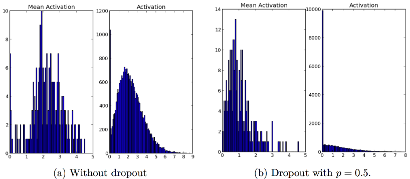
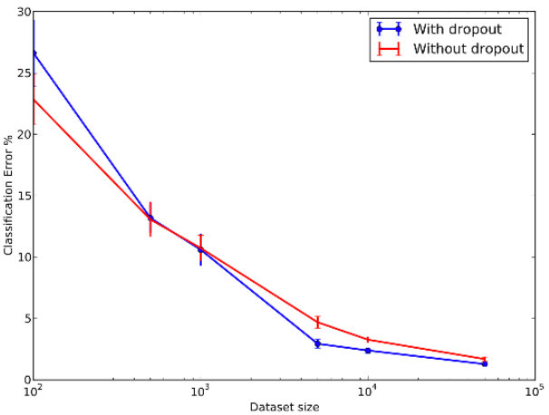

# Regularization for Deep Learning : Part - 2

- [Regularization for Deep Learning : Part - 2](#regularization-for-deep-learning---part---2)
- [Parameter Tying](#parameter-tying)
  * [Paramter Dependency](#paramter-dependency)
  * [Motivation and Goal](#motivation-and-goal)
  * [Scenario of Parameter Tying](#scenario-of-parameter-tying)
  * [L2 Penalty for Parameter Tying](#l2-penalty-for-parameter-tying)
- [Parameter Sharing](#parameter-sharing)
- [Bagging and Ensemble Methods](#bagging-and-ensemble-methods)
  * [How does Bagging work?](#how-does-bagging-work-?)
  * [Bagging Example](#bagging-example)
  * [Usage of Bagging](#usage-of-bagging)
  * [Tacit Rules of Bagging](#tacit-rules-of-bagging)

# Parameter Tying
## Paramter Dependency
* L2 regularization/weight decay **penalizes models parameters from deviating from fixed value of 0.**
* Sometimes we need **other ways to express prior knowledge of parameters.**
* We may know from domain and model architecture that ther should be **some dependencies between model parameters.**

## Motivation and Goal
We want to express that certain parameters **should be close** to one another.

## Scenario of Parameter Tying
* Considering a situation, where 2 models are performing **same classification task, with somewhat different input distributions**. 
* Parameters of one model are regularized (trained in **supervised paradigm**) using norm penalty, **to be close to parameters** of another model (trained in **unsupervised paradigm**). 
* </img>
* Two models will map the input to **2 different, but related output** 
</img>

## L2 Penalty for Parameter Tying
* If tasks are similar enough, then **params of both models should be close to each other**  
</img>
* We can leverage this information via **regularization, using parameter norm penalty**
</img>

# Parameter Sharing

* Another approach to make parameters of different model close to one another is to **force sets of parameters to be equal**. This method of regularization is called **Parameter Sharing.** 
* We interpret the various models or model components **as sharing a unique set of parameters.** 
* Only **subset of params need to be stored in memory.**
* Example: Paramter sharing in CNNs 
</img>

# Bagging and Ensemble Methods
* Bagging (**bootstrap aggregating**) - technique for reducing general-ization error by **combining several models.**
* Train several different **models separately**, then have **all models vote** on the output for test examples. This strategy is known as **model averaging.** Techniques employing this strategy are known as **ensemble methods.**
</img> 

## How does Bagging work?
* Considering **k regression models** (with minimizing MSE).
* Suppose each model makes  error **εi** on each example, then 
</img> 
* Error made by **average prediction of models is** 
</img> 
* **Expected square error** of ensemble predictor is  
</img> 
  * If errors are **perfectly correlated** and **c=v**, **MSE=v** and model won't work at all.
  * If errors are **perfectly uncorrelated** and **c= 0**, error will be only **v/k**.
  
## Bagging Example 
* Below is an example of **8-detector**, where **first ensemble** learns that a **loop at top** implies the digit is 8 and **second ensemble** learns that **loop at bottom** implies 8. 
</img> 

## Usage of Bagging
* **Trend regression** on the data ozone-temperature.
* **Gray line** is regression line with each samples.
* **Red line** is average line 
</img> 

## Tacit Rules of Bagging
* **OOB (Out-Of-bag) Sampling**
  * Special rule for sampling with **replacement.**
  * If we sample the example with **random sampling replacement**, selecting probability of each example is:
</img>  
  * If **N is large enough**, then 
</img>  

* Bagging in **neural networks**
  * Random initialization
  * Random selection  of minibatches
  * Differences in hyperparameter

# Dropout
## Overfitting
* Excessive focus on training data can lead to **poor results on actual test data**. 
</img>  

## Solution for Overfitting
* Regularization
  * L1-norm penalty
  * L2-norm penalty
* Data augmentation
* Dropout (2012)
   * A method of bagging applied to neural networks
   * An inexpensive but powerful method of regularizing a broad family of models
   
## What is Dropout?
* A technique that **omits a portion of network.**
* Trains the ensembles consisting of all subnetworks that can be formed by **removing nonoutput units** from an underlying base network.
* A unit from network can be removed by multiplying **its output value by zero**.
* Typically, **input unit** is included with **probability 0.8**, and a **hidden unit** is included with **probability 0.5**.
</img>

## Effects of Dropout
* Avoids **co-adaptation**, a trend that some neurons tend to represent similar features
* Captures **clear features** by avoiding co-adaptations.
</img>
* Makes neurons **more sparse.**
</img>

## Problems Addressed by Dropout
* **Omitting of neurons**, to mimic the voting in ensemble technique, instead of building the multiple models.
* **Product the probability** that a neurons will survive to weight, at **inference level** (**accumulation of votes** from all models).

## Differences between Bagging and Dropout
| S.No. | Bagging                                                                                                              | Dropout                                                                                                                                                                                                                     |
|-------|----------------------------------------------------------------------------------------------------------------------|-----------------------------------------------------------------------------------------------------------------------------------------------------------------------------------------------------------------------------|
| 1.    | All models are **independent**                                                                                           | Models **share parameters**.  Each model **inherits** a different subset of parameters  **from parent neural network.**                                                                                                           |
| 2.    | Each model is **trained to**   **convergence** on its own training  set.                                               | Most models are **not explicitly trained** at all.  Tiny **fraction of possible subnetworks** are each trained  for single step and **parameter sharing** causes **remaining subnetworks**  to arrive at **good settings of network**. |
| 3.    | **Prediction** of ensemble is given by   **arithmetic mean of probability distribution** </img>  generated by **each model *i*.** as follows -  </img> | Each submodel defined by **mask vector µ** defines a **probability**  **distribution.** Arithmetic mean over **all masks** is given by </img>                                                                                       |

## Advantages and Disadvantages of Dropout

| S.No. | Advantages                                                                | Disadvantages                                                                                 |
|-------|---------------------------------------------------------------------------|-----------------------------------------------------------------------------------------------|
| 1.    | Computationally **cheap**, ***O(n) computation*** per example per update. | Cost of using dropout in **complete system can be significant**.                              |
| 2.    | **Does not limit type of model** or training procedure that can be used.  | When extremely **few labeled training examples** are available, dropout is **less effective.** |

## Dropout Rate (p)
* Default interpretation of the dropout hyperparameter is **probability of training a given node in a layer**, where **1.0 means no dropout**, and **0.0 means no outputs from the layer.**
* A **good value for dropout** in a hidden layer is between **0.5 and 0.8**. 
* **Input layers** use a larger dropout rate, such as of **0.8.**

## Effect of Data Set Size on Dropout
* Dropout is more powerful for **larger dataset.**
 </img> 

# Adversarial Training
* Applying an **imperceptible non-random perturbation** to a test image, it is possible to arbitrarily **change the network’s prediction.**
* Primary causes of adversarial examples is **excessive linearity.**
* Value of a linear function in neural networks, build out of linear blocks, can change rapidly, if it has **numerous inputs.**
* Adversarial training helps to illustrate **power of using a large function family** in combination with **aggressive regularization.**
* Adversarial examples also provide a means of **accomplishing semi-supervised learning**. 

## Virtual Adversarial Examples
* At point ***x***, **not associated with any label**, model itself assigns some label ***ˆy***, which **may/maynot be a true label.**
* We can seek an **adversarial example x'** that causes the classifier to output a **label y' with y' != ˆy**.
* Adversarial examples generated using **not the true label** but a l**abel provided by a trained model** are called **virtual adversarial example.**
* The classifier may then be trained to **assign same label to x and x'.**
