# Optimization for Training Deep Models

# Learning v/s Optimizing
* Machine learning acts **indirectly** by trying to **optimize performance measure, P,** defined w.r.t test set.
* Goal of learning is to reduce **expected generalization errror.**
* Learning algorithms **reduce cost functions**
    * By **minimizing expected loss** on training data set.
    * In the hope that **indirect optimization will improve performance.**
* Expectation is taken across **data-generating distribution**, rather than finite training set. 
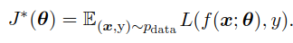</img>

## Emperical Risk
* Simplest way to **convert ML problem to an optimization problem** is to **minimize expected loss** on the training set.
* Replacing **true distribution p(x, y)** with **empirical distribution ˆp(x, y)** defined by the training set. 
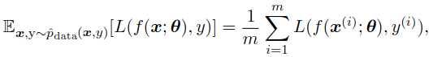</img>
* **m** is number of training examples.
* Training process based on **minimizing average training error** is known as **empirical risk minimization**.
* Rather than **optimizing risk directly, optimize empirical risk** and hope that **risk decreases significantly** as well.

## Disadvantages of Emperical Risk Method
* Prone to **over-fitting.**
* Models with **high capacity** can **memorize** training data.
* Most effective loss functions are based on **SGD**, but losses like **0-1 loss have no useful derivatives.**

# Surrogate Loss Function and Early Stopping
* In situations where loss function is **difficult to/cannot be optimized,** we optimize **surrogate loss function**, acting as proxy with several advantages -
    * Differentiable
    * Improves robustness.
## Difference between Genral Optimization and Optimizing Training Algorithms
*  **Training algorithms** do not usually halt at a local minimum. ML algorithm **minimizes surrogate loss function** and halts when **convergence criterion based on early stopping** is satisfied.
* Training **halts** while the surrogate loss function **still has large derivatives.**

# Batch and Mini-batch Algorithms
* **Objective function** usually **decomposes as a sum** over training examples.
* **Optimization** in ML, typcally computes loss and updates parameters **iteratively**, e.g. **stochastic gradient descent.**
* Computing **exact expectation**/ **using entire training set** (batch/deterministic algorithm) can be **computationally expensive.**
* Minibatch algorithms compute expectation by **randomly sampling small number of examples** from dataset, then taking the average over only those examples.

## Various Information extracted from Batch/Minibatch Algorithms
* Second order methods **that use Hessian matrix,** require much **larger batch sizes.**
* Minibatches should be **sampled randomly.**
* **Minibatch SGD** follows gradient of **true generalization error**, as long as **no examples are repeated**.
* When using an **extremely large training set**, **underfitting** and **computational efficiency** becomes the predominant concerns.

## Batch v/s Minibatch
* Each iteration in **minibatch** may have **poor optimization performance** than batch algorithm.
* However, after **many iterations**,mini-batch algorithm generally **converges to optimal state.**
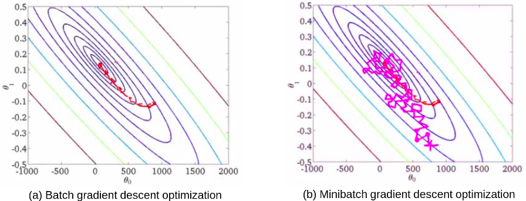</img>

# Challenges in Neural Network Optimization
## Ill-Conditioning
* Arises due to **ill-conditioning of Hessian matrix, H.**
* **SGD gets stuck** i.e. even very **small steps increase cost function.**
* 2nd order **Taylor series of cost function** predicts that gradient step of  −ε**g** will **add following term to cost**. 
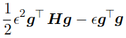</img>
* **Ill conditioning in Taylor-Series** occurs when: 
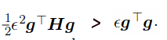</img>

## Local Minima
* If **starting point** of gradient descent was chosen **inappropriately**, a non-convex fucntion **cannot reach global minimum.** 
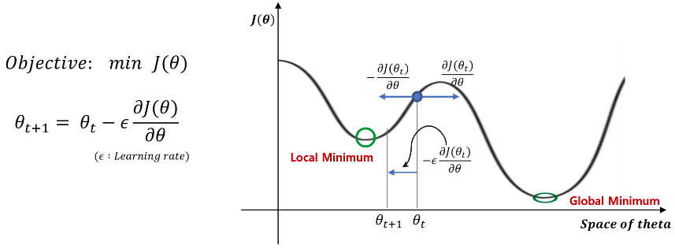</img>

## Plateaus, Saddle Points and Other Flat Regions
* In non-convex functions, **local minima are rare** as compared to other **zero gradient point called saddle points.**
* At **saddle point**, **Hessian matrix** has both **positive and negative eigenvalues**.
* **Cost (+) > Cost( saddle point ) > Cost (-)** 
   * Cost (+) : Cost of points lying on **+ve eigen vectors**. 
   * Cost (-) : Cost of points lying on **-ve eigen vectors**
* Sample **saddle point in a deep neural network** is shown below 
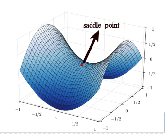</img>

### Properties Observed of Random Functions w.r.t Eigen Values
* In higher-dimensional spaces, **local minima are rare**, and **saddle points are more common.**
* **Eigenvalues** of Hessian become **more likely to be positive** as we reach regions of **lower cost.**
* **Local minima** are much more likely to **have low cost** than high cost.
* **Critical points** with **high cost** are far more likely to be **saddle points.**
* **Critical points** with **extremely high cost** are more likely to be **local maxima.**

## Cliffs and Exploding Gradients
* **Neural networks with many layers** often have extremely steep regions resembling **cliffs,** resulting due to **multiplication of  several large weights together.** 
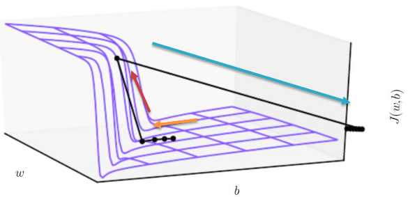</img>
* **Gradient doesnot specify optimal size** but specifies **optimal direction withinan infinitesimal region.**
* When **traditional gradient descent** algorithm proposes **making a very large step :**
     * **Gradient Clipping** interevens
     * Reduces **step-size**
     *  making it **less likely to go outside** the region where gradient indicates **direction of approximately steepest descent.**
 * Following is an example of **Gradient Clipping for Handling Cliffs** 
 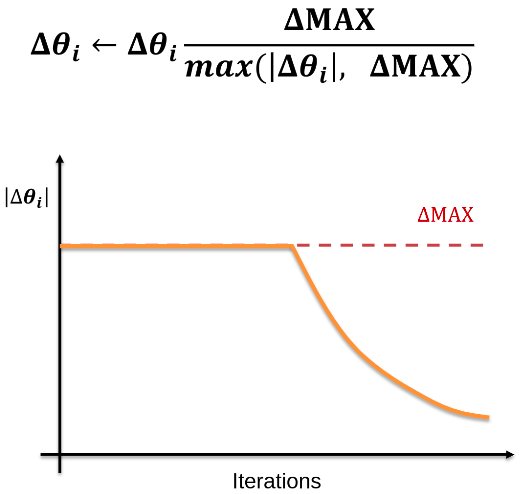</img>
 
## Long Term Dependencies
* Computational graph becomes **extremely deep.**
* **Repeated application of same parameters** gives rise to especially pronounced difficulties.
### Sample Scenario describing Exploding Gradient Problem
* Computational graph containing path that consists of **repeatedly multiplying by a matrix W,** which after **t-steps** is equivalent to **multiplying by**  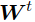</img> -- 
   * 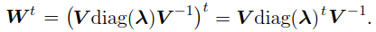</img> 
   * If **λi > 1**, *explosion,* makes learning **unstable** 
   * If **λi < 1**, *vanish,*, make it **difficult to know which direction** parameters should move **to improve cost function**
   
# Basic Algorithms

## Stochastic Gradient Descent (SGD)
* **Unbiased estimate** of gradient can be calculated by taking **average gradient on a minibatch** of **m examples** drawn i.i.d from the data-generating distribution.
* **Crucial parameter** for the SGD algorithm is the **learning rate.**
* **Learning rate** should be **decayed** with time until iteration **τ**. 
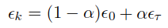</img> 
* **Sufficient condition** to guarantee **convergence of SGD** is 
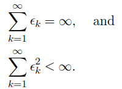</img> 
* 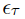</img> should be set to **1% of** 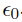</img> 
* If value of  </img> is -
      * **too high,** curve shows **violent oscillations**, cost function **increases.**
      * **too low,** curve can get **stuck in high cost value.**
* **Batch gradient descent** enjoys **better convergence rates** than stochastic gradient descent in theory.
* **Gradient Formula** 
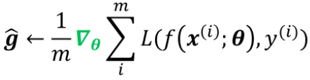</img>
* **Updation Formula** 
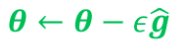</img>

## Momentum
* Momentum method is designed to **accelerate learning.**
* Accumulates an **exponentially decaying moving** average of past gradients and continues to move in their direction.
* Below is comparison of **graident descent with and without momentum** - 
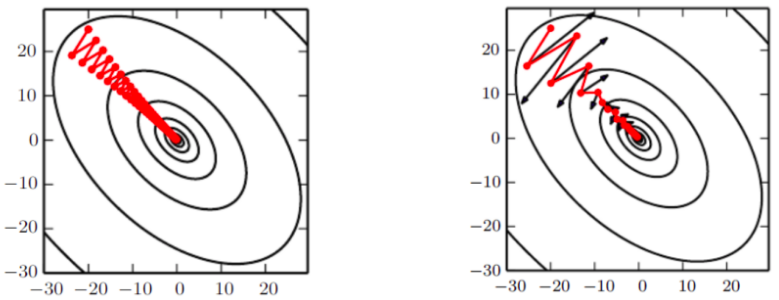</img>
* **Update rule** in momentum method is given by - 
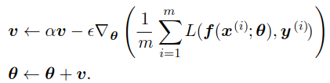</img>
* **Accumulate velocity**-  
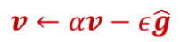</img>

## Nesterov Momentum
* **Gradient** is evaluated **after current velocity** is applied.
* Attempt to **add a correction factor** to the standard method of momentum.
* Comparison between **standard momentum and Nesterov momentum methods** are given as follows - 
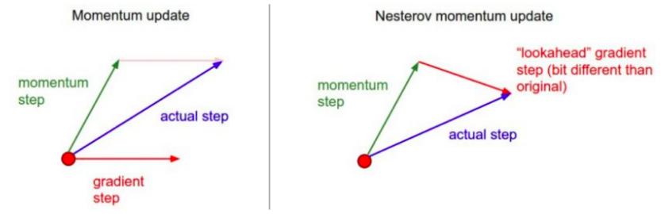</img>
* **Update rule** 
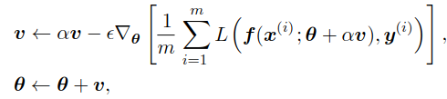</img>

# Algorithms with Adaptive Learning Rate
## AdaGrad
* **Adaptive Gradient** is a modified SGD with **per-parameter learning rate.**
    * **Increases learning rate** for parameters having **small gradient.**
    * **Decreases learning rate** for parameters having **large gradient.**
 * **Gradient** for AdaGrad is given by - 
 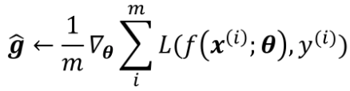</img>
 * **Accumulate Squared Gradients** 
 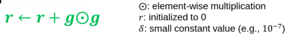</img>  
 * **Apply Update** 
  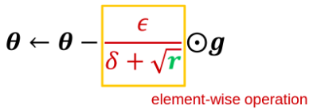</img> 

## RMSProp
* **Root Mean Square Propagation** is modified version of **AdaGrad.**
* Modifies **Gradient accumulation** to **exponentially weighted moving average.**
* **Gradient -** 
 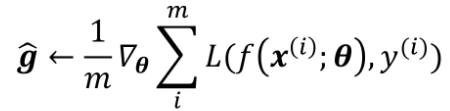</img> 
 * **Accumulate Squared Gradients -** 
 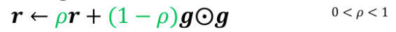</img> 
 * **Apply update -** 
 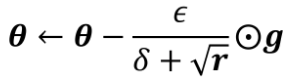</img>

## Adam
* Combination of **RMSProp and momentum.**
* Accumulate **first and second order moment estimates -** 
 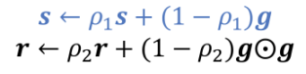</img>
* Correct **bias in 1st and 2nd order moments -** 
  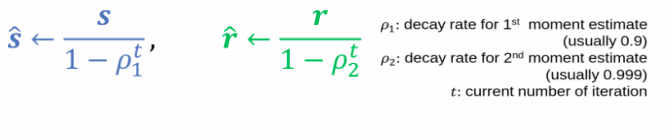</img>
* **Apply update -** 
  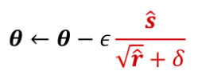</img>

# Approximate Second-Order Methods
## Newton's Method
* Optimization scheme based on **second-order Taylor series expansion** to approximate **J(θ)** near some point θ0, **ignoring derivatives of higher order.** 
 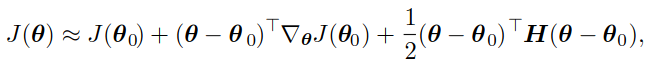</img>
* **Newton parameter update rule** is given by - 
 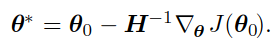</img>
* Newton’s method can be **applied iteratively,** as long as Hessian remains **positive definite.**
* Hessian matrix can be **regularized, as below** incase eigen values of Hessian matrix are **not positive definite**, Newton's method can **cause updates to move in wrong direction.** 
 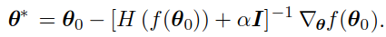</img>
 * **Disadvantages of Newton's Method:** 
      * Huge computational **cost.**
      * Computational **complexity** of 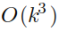</img>
      * Networks with **very small number of parameters** can be practically trained via Newton's method.
      
## Conjugate Gradients

* Method to **efficiently avoid calculation of inverse Hessian** by iteratively descending conjugate directions.
* **Current line search direction**, is guaranteed to be **orthogonal to previous line search direction.**

### Problem Statement
By **following gradient** at end of each line search we are **undoing progress we have already made in the direction of the previous line search.**
 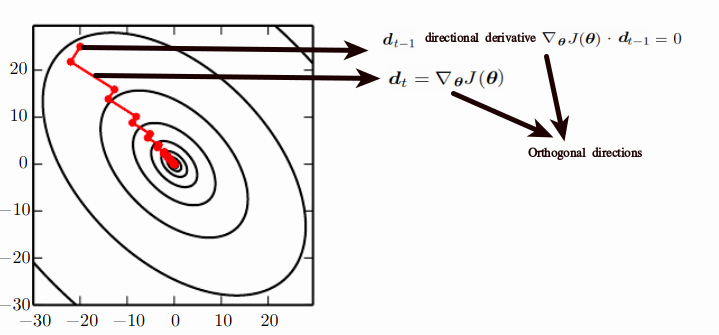</img>
### Solution 
* We seek to find a **search direction** that is **conjugate to previous** line search direction.
* At iteration *t*, direction, next search direction will be of the form - 
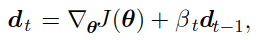</img>
* 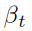</img> magnitude controls how much of direction, 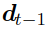</img>,
we should **add back to current search direction.**
* Two directions 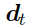</img> and </img>  are said to be **orthognal** iff - 
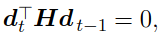</img> 
* Two methods to compute value of </img> are - 
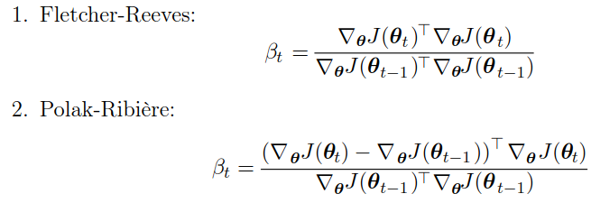</img> 

