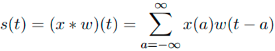

# Convolutional Neural Networks

Convolutional networks also known as convolutional neural networks, or CNNs, are a specialized kind of neural network for **processing data that has a known grid-like topology.**

# Convolution Operation
The convolution operates on the **input** with a **kernel (weights)** to produce an **output map** given by: 
</img>
## Example Demonstrating Convolution Operation
</img>
