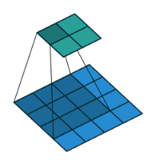
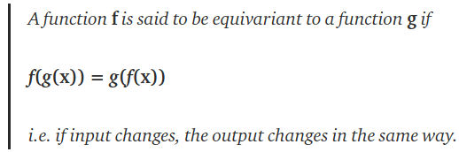
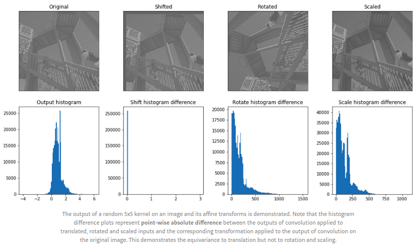
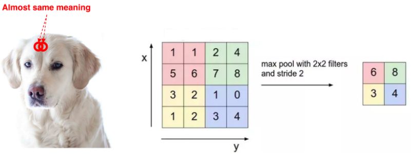
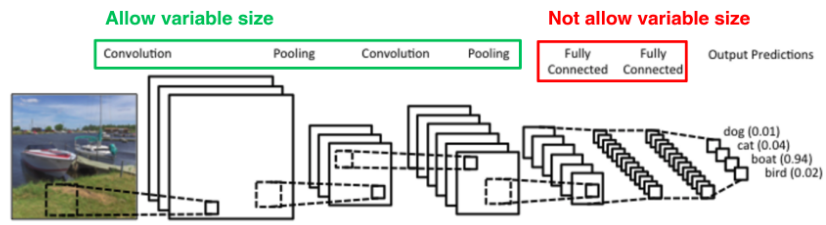
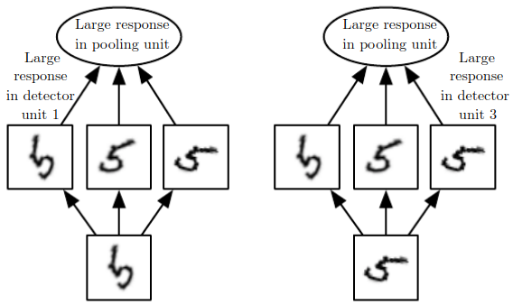
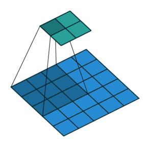
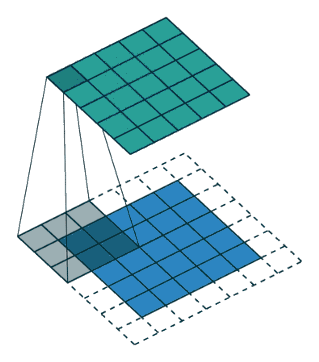
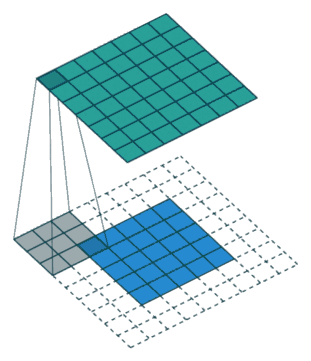

# Convolutional Neural Networks

Convolutional networks also known as convolutional neural networks, or CNNs, are a specialized kind of neural network for **processing data that has a known grid-like topology.**

# Convolution Operation
The convolution operates on the **input** with a **kernel (weights)** to produce an **output map** given by: 
</img>
* **1-D** discrete convolution operation can be given by: 
</img> 
* **2-D** discrete convolution operation can be given by: 
</img> 
* **2-D convolution operation** can be visualized as below: 
</img> 
## Example Demonstrating Convolution Operation
</img>

## Properties of Convolution Operation and Cross-Correlation
### Commutative Property
* Convolution operation is **commutatiive**.
* Commutative property arises because we have **flipped the kernel** relative to the input 
</img>
</img>

### Cross-Correlation 
* Function which is analogous to convolution operation without flipping the kernel is called **cross-correlation operation.**
* Cross-correlation is **not commutative.** 
* **Convolution operation:** 
</img>
* **Correlation operation:** 
</img> 

## Toeplitz Matrix
* **1D** convolution operation can be represented as a **matrix vector product.** 
* The kernel marix is obtained by composing weights into a **Toeplitz matrix.**
* Toeplitz matrix has the property that **values along all diagonals are constant.** 
</img> 

## Block-Circulant and Doubly-Block-Circulant Matrix
* To **extend** the concept of Toeplitz matrix towards **2-D input**, we need to **convert 2-D input to 1-D vector.**
* **Kernel needs to be modified** as before but this time resulting in a **block-circulant matrix.**
* A **circulant matrix** is a special case of a **Toeplitz matrix** where each **row is equal to the row above shifted by one element.** 
</img> 

* A matrix which is **circulant with respect to its sub-matrices** is called a **block circulant matrix.** 
</img> 
* If each of the **submatrices is itself circulant**, the matrix is called **doubly block-circulant matrix.** 
</img> 

# Motivation
## Sparse Interactions
* In traditional Neural Networks, **every output unit interacts with every input unit.** 
* Convolutional networks, however, typically have **sparse interactions,** by making **kernel smaller than input.**
    * Reduces memory requirements
    * Improves statistical efficiency
* In a deep convolutional network, units in the deeper layers may **indirectly interact** with a larger portion of the input.
</img> 

## Parameter Sharing
* Parameter sharing refers to **using same parameter for more than one function in a model.**
* In convolutional neural net, **each member of kernel** is used at **every position of input** i.e. parameters used to compute different output units are **tied together** (all times their values are same).
* **Sparse interactions and parameter sharing combined** can improve efficiency of a linear function for **detecting edges** in an image

### Equivariance
* Parameter sharing in a convolutional network **provides equivariance to translation.**  
</img> 
* Translation of image results in corresponding translation in the output map.
* Convolution operation by itself is **not equivariant to changes in scale or rotation.** 
</img> 

# Pooling
* A convolution layer consists of **3 layers -** 
     * Convolution
     * Activation (Detector Stage)
     * Pooling
* A pooling function **replaces the output** of net at a certain location with **summary statistic of nearby outputs.**
* Common summary statistics are : **mean, median, weighted average.**  
</img> 
* Pooling makes the representation slightly **translation invariant**, in that **small translations** in the input **do not cause large changes in output map.**
* It allows detection of a particular feature **if we only care about its existence**, not its position in an image.
* Pooling **reduces input size to the next layer** in turn reducing the number of computations required upstream.

## Inputs having Variable Size
* **Classification layers** requires **fixed size** of their inputs. 
* **Pooling** makes their **output fixed size** by changing their **pooling size, stride etc.** 
</img> 

## Learned Invariances
* Pooling over feature channels can be used to develop invariance to certain transformations of the input.
* Units in a layer may be **developed to learn rotated features** and then pooled over. This property has been used in **Maxout networks.** 
</img> 

# Convolution and Pooling as an Infinitely Strong Prior
## Weight Prior
**Assumptions about weights (before learning)** in terms of acceptable values and range are encoded into the **prior distribution** of weights. 

| S.No. | Prior Type        | Variance/Confidence Type                                                                    |
|-------|-------------------|---------------------------------------------------------------------------------------------|
| 1.    | Weak              | High Variance, Low Confidence                                                               |
| 2.    | Strong            | **Narrow range** of values about which we are **confident**  before learning begins.        |
| 3.    | Infinitely strong | Demarkates certain values as **forbidden** completely  assigning them **zero probability.** |

* Convolution imposes an **infinitely strong prior** by making the following **restrictions on weights:** 
     * **Adjacent units** must have the **same weight** but shifted in space.
     * Except for a **small spatially connected** region, all **other weights** must be **zero.**
* Features should be **translation invariant.**
* If tasks relies on preserving specific spatial information, then pooling can cause on all features can increase training error.

# Variants of the Basic Convolution Function

In practical implementations of the convolution operation, certain modifications are made which deviate from standard discrete convolution operation -

* In general a convolution layer consists of application of **several different kernels** to the input. Since, convolution with a **single kernel can extract only one kind of feature.**
* The input is generally not real-valued but instead **vector valued.** 
* Multi-channel convolutions are commutative iff **number of output and input channels is the same.**

## Effect of Strides
* **Stride** is the number of **pixels shifts** over the input matrix.
* In order to allow for calculation of features at a **coarser level** strided convolutions can be used. 
* The effect of strided convolution is the same as that of a **convolution followed by a downsampling stage.**
* Strides can be used to **reduce the representation size.**
* Below is an example representing **2-D Convolution, with (3 * 3) Kernel and Stride of 2 units.** 
</img> 

## Effect of Zero Padding
* Convolution networks can implicitly zero pad the input V, to make it wider.
* Without zero padding,the width of representation shrinks by one pixel less than the kernel width at each layer.
* Zero padding the input allows to control kernel width and size of output independently.

### Zero Padding Strategies
3 common zero padding strategies are: 

| Zero Padding Type       | Properties                                                                                                                                                                                                                                                                                                                                                                                                                                | Example                                                 |
|-------------------------|-------------------------------------------------------------------------------------------------------------------------------------------------------------------------------------------------------------------------------------------------------------------------------------------------------------------------------------------------------------------------------------------------------------------------------------------|---------------------------------------------------------|
| **Valid Zero-Padding**  | 1. **No zero padding** is used.  2. Output is computed only at places where **entire kernel lies inside the input.**  3. **Shrinkage > 0**  4. **Limits #convolution layers** to be used in network  5. Input's width = m, Kernel's width = k,  **Width of Output = m-k+1**                                                                                                                                                 | </img>  |
| **Same Zero-Padding**   | 1. Just enough **zero padding is added** to keep:       1.a. **Size(Ouput) = Size(Input)**  2. Input is padded by **(k-1) zeros**  3. Since the **#output units connected to border pixels is less**   than that for centre pixels, it may **under-represent border pixels.**  4. Can **add as many convolution layers** as hardware can support  5. Input's width = m, Kernel's width = k,  **Width of Output = m**  | </img>  |
| **Strong Zero-Padding** | 1. The input is padded by enough zeros such that **each input pixel is   connected to same #output units.**  2. Allows us to make an **arbitrarily deep NN.**  3. Can **add as many convolution layers** as hardware can support  4. Input's width = m, Kernel's width = k,  **Width of Output = m+k-1**                                                                                                                    | </img>  |

