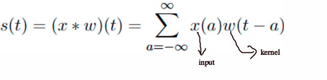
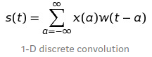
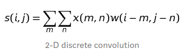
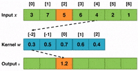
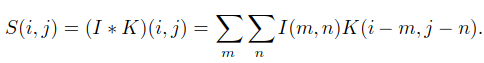
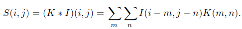
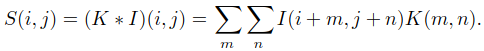

# Convolutional Neural Networks

Convolutional networks also known as convolutional neural networks, or CNNs, are a specialized kind of neural network for **processing data that has a known grid-like topology.**

# Convolution Operation
The convolution operates on the **input** with a **kernel (weights)** to produce an **output map** given by: 
</img>
* **1-D** discrete convolution operation can be given by: 
</img> 
* **2-D** discrete convolution operation can be given by: 
</img> 
## Example Demonstrating Convolution Operation
</img>

## Properties of Convolution Operation and Cross-Correlation
### Commutative Property
* Convolution operation is **commutatiive**.
* Commutative property arises because we have **flipped the kernel** relative to the input 
</img>
</img>

### Cross-Correlation 
* Function which is analogous to convolution operation without flipping the kernel is called **cross-correlation operation.**
* Cross-correlation is **not commutative.** 
* **Convolution operation:** 
</img>
* **Correlation operation:** 
</img>
