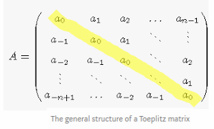
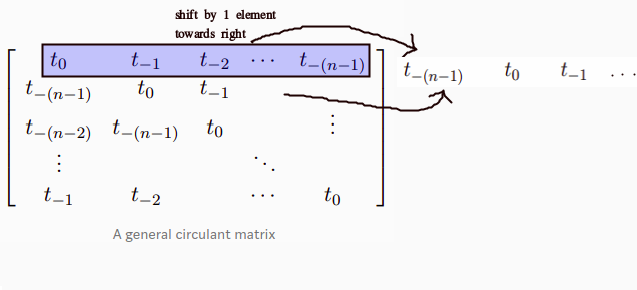
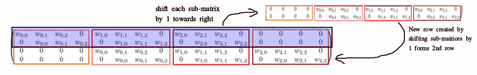
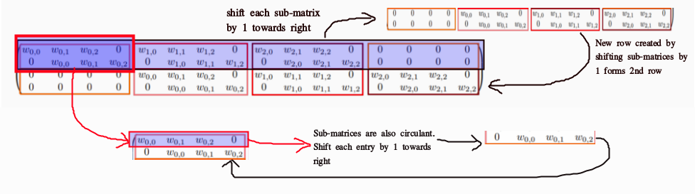
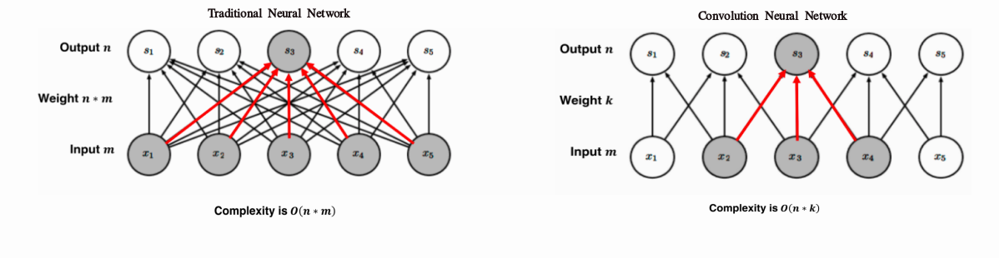

# Convolutional Neural Networks

Convolutional networks also known as convolutional neural networks, or CNNs, are a specialized kind of neural network for **processing data that has a known grid-like topology.**

# Convolution Operation
The convolution operates on the **input** with a **kernel (weights)** to produce an **output map** given by: 
</img>
* **1-D** discrete convolution operation can be given by: 
</img> 
* **2-D** discrete convolution operation can be given by: 
</img> 
## Example Demonstrating Convolution Operation
</img>

## Properties of Convolution Operation and Cross-Correlation
### Commutative Property
* Convolution operation is **commutatiive**.
* Commutative property arises because we have **flipped the kernel** relative to the input 
</img>
</img>

### Cross-Correlation 
* Function which is analogous to convolution operation without flipping the kernel is called **cross-correlation operation.**
* Cross-correlation is **not commutative.** 
* **Convolution operation:** 
</img>
* **Correlation operation:** 
</img> 

## Toeplitz Matrix
* **1D** convolution operation can be represented as a **matrix vector product.** 
* The kernel marix is obtained by composing weights into a **Toeplitz matrix.**
* Toeplitz matrix has the property that **values along all diagonals are constant.** 
</img> 

## Block-Circulant and Doubly-Block-Circulant Matrix
* To **extend** the concept of Toeplitz matrix towards **2-D input**, we need to **convert 2-D input to 1-D vector.**
* **Kernel needs to be modified** as before but this time resulting in a **block-circulant matrix.**
* A **circulant matrix** is a special case of a **Toeplitz matrix** where each **row is equal to the row above shifted by one element.** 
</img> 

* A matrix which is **circulant with respect to its sub-matrices** is called a **block circulant matrix.** 
</img> 
* If each of the **submatrices is itself circulant**, the matrix is called **doubly block-circulant matrix.** 
</img> 

# Motivation
## Sparse Interactions
* In traditional Neural Networks, **every output unit interacts with every input unit.** 
* Convolutional networks, however, typically have **sparse interactions,** by making **kernel smaller than input.**
    * Reduces memory requirements
    * Improves statistical efficiency
* In a deep convolutional network, units in the deeper layers may **indirectly interact** with a larger portion of the input.
</img> 

## Parameter Sharing
* Parameter sharing refers to **using same parameter for more than one function in a model.**
* In convolutional neural net, **each member of kernel** is used at **every position of input** i.e. parameters used to compute different output units are **tied together** (all times their values are same).
* **Sparse interactions and parameter sharing combined** can improve efficiency of a linear function for **detecting edges** in an image

