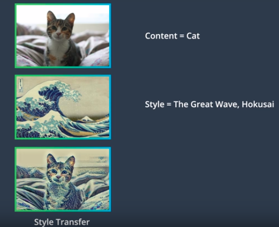
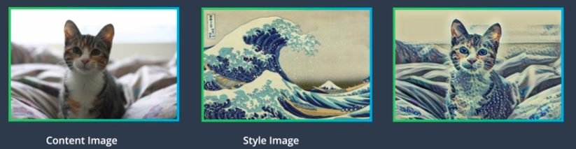

# Style Transfer using CNNs

# Overview
One of the use cases of CNN is **style transfer.** Style transfer allows you to apply the style of one image to another image of your choice. For instance, in the below style-transfer example- 
</img>

We have applied **style of Hokusai wave** to the **content of cat.** 

# Separating Style and Content
Style transfer will look at 2 different images: **Style image** and **Content image**. 
Using a trained CNN, the model will try to find style from one image and content from another and would finally try to merge the two images to create a new third image. 
</img>

# VGG19 and Content Loss
## VGG19
Below is an example of VGG19 CNN architecture which consists of multiple convolution and max-pooling layers, that uses style transfer method.  
</img> 

The first step to perform style transfer is to pass both style and content image through the CNN as below.  

1. First, when the network sees the content image, it will go through the feed-forward process, until it gets throgh convolution layer that is deep in the network.  
**Output** of this layer will be **content representation** of input image. 
</img> 

2. Next, when the CNN sees the style image, it extracts different features from multiple layers that represent the style of an image. 
</img> 

3. Finally it will merge the content from step-1 and style from step-2 to form the **target image.**  
</img> 

## Content Loss
Content loss is a loss that calculates the difference between content (Cc) and target (Tc) image representations. We calculate the **mean squared difference** between 2 representations, which tells us how far away are the 2 representations from one another. 
To create the **target image**, our aim would be to minimize this loss.
Our goal is to **only change target image**, until its content representation matches that of content image.  
</img> 

# Gram Matrix
The style representations of our target image relies on **correlations between features of individual layers of VGG19 network.** Style represntation is calculated as an image passes through the network at the 1st convolution layer in all 5 stacks.   
Correlation at each layer is given by **Gram Matrix.**

## Steps to calculate Gram Matrix
For instance, we take 4-by-4 input image and we convolve it with 8 different image filters to create convolution layer. That is this layer ahs 8 feature maps that we want to find relationships between. 
</img> 

Below are the steps to follow inorder to calculate Gram matrix for the above input image - 
1. First, vectorize (flatten) the values in feature maps. Flattening feature maps converts 3D convolution layer into 2D matrix of values. 
</img>
</img> 

2. Next step, multiply the 2D matrix from step-1, with its transpose, to get the Gram matrix. The resultant Gram matrix contains non-localized information about the layer. Non-localized information is information that would still be there even if the image is shuffled around in space.
</img> 

3. Finally, we are left with 8-by-8 Gram matrix whose values indicate similarities between the layers. Hence, *G(4,2)* will indicates similarity between 4th and 2nd feature maps in a layer. 

# Style Loss
To calculate style loss between style image and target image, we find the **mean squared distance between style and target image's Gram matrices**.

image source - https://www.udacity.com/course/deep-learning-nanodegree--nd101
