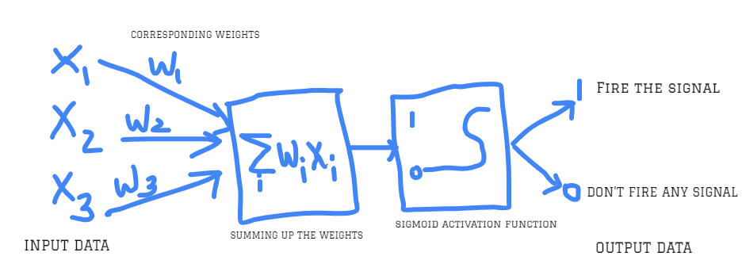

# Overview 
Basic idea of an Artifical Neural Network is to mimic a biological neuron with axons, dendrites, nucleus etc.
For a simple neural network, you would need 2 neurons, who pass on information using **Synapse**, flowing from **dendrite** of sending neuron to **terminal axon** of recieving neuron.

## 1. Biological NN v/s Artifical NN
In ANN, the input data will have certain weights attached with them. Before passing data to neuron, the **weighted sum** is calculated and passed on to the **Activation** function.
This function bears a threshold value to check against weighted sum. For e.g if weighted sum is less than threshold value, do not pass the information to next neuron (boolean value 0) else fire a signal (boolean value 1). 

Below diagram shows a basic neural network model :: 



## 2. Installing TensorFlow in Ubuntu
1. TensorFlow is supported for Ubuntu versions 16.0.4 or later. If you are using an older version (14..0.4), [upgrade your Ubuntu to a higher version](https://wiki.ubuntu.com/XenialXerus/ReleaseNotes).
2. Following are the **pip instructions** to download tensorflow -


        $ sudo apt-get install python3-pip python3-dev
        # Ubuntu/Linux 64-bit, CPU only, Python 3.5
        $ export TF_BINARY_URL=https://storage.googleapis.com/tensorflow/linux/cpu/tensorflow-0.9.0-cp35-cp35m-linux_x86_64.whl
        $ sudo pip3 install --upgrade $TF_BINARY_URL
        $ pip install --upgrade tensorflow `
        
3. To check if tensorflow is installed properly, type python3 in console and try to **import tensorflow**

## 3. Feed Forward and Back Propagation (1 Epoch)
1. In a basic feed forward neural network, the input data is passed straight through. In backpropagation, the optimizer goes backwards and manipulates the weights.


        `
        1. input data with weights -> hidden layer 1 (w/ activatn. functn.) -> hidden layer 2 (w/ activatn. functn.) -> output layer
        2. compare actual output w/ intended o/p -> cost function (Cross Entropy)
        3. Optimization function -> minimizes cost        
        4. feed-forward + back-propagation = 1 epoch (cycle) -> repeat till we minimize cost functn.

## 4. Softmax function and Cross Entropy Loss
1. [Softmax function](https://deepnotes.io/softmax-crossentropy) takes into account N-Dimensional vectors of real numbers and transforms it into a probablistic distribution ranginf from (0,1).
2. Softmax function can be expressed like this - 
```python
def softmax(X):
    exps = np.exp(X - np.max(X))
    return exps / np.sum(exps)
```
3. Since softmax function gives probablistic distribution, it is used as the final layer in neural networks. Derivative/gradient of softmax function is passed to previous layers during back-proagation.
4. **Cross Entropy** is the distance between desired output and actual output.
5. Derivative of Cross Entropy Loss with Softmax is used as the output layer extensively.
