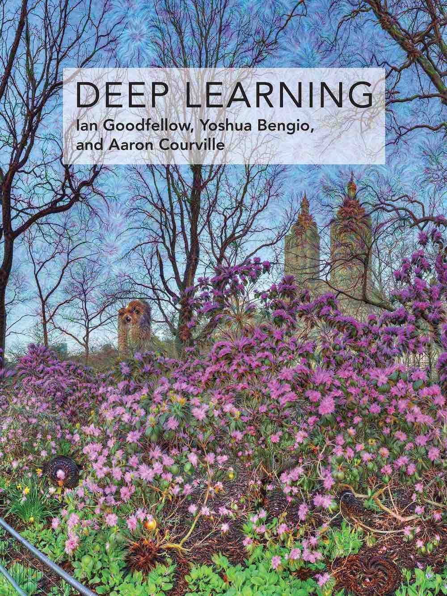

# Overview

|  |  |
|-------------------------------------------------------------------|-------------------------------|

This repository contains - 
:heavy_check_mark: Chapter-wise **summarized notes**. 
:heavy_check_mark: Chapter-wise **PDF.** 
:heavy_check_mark: Chapter-wise **codes.** (.ipynb files) 
:heavy_check_mark: Summarized notes on Udacity's **Nanodegree in AI** ([Bertelsmann Scholarship](https://www.udacity.com/bertelsmann-tech-scholarships)) 

# Chapters
- **Part I: Applied Math and Machine Learning Basics** 
  - Chapter 2: Linear Algebra - [Notes](https://github.com/purvasingh96/Deep-learning-with-neural-networks/blob/master/Notes/Ch_1_Linear_algebra/Readme.md)
  - Chapter 3: Probability and Information Theory - [Notes](https://github.com/purvasingh96/Deep-learning-with-neural-networks/blob/master/Notes/Ch_2_Probability_and_Information_Theorey/Readme.md)
  - Chapter 4: Numerical Computation - [Notes](https://github.com/purvasingh96/Deep-learning-with-neural-networks/blob/master/Notes/Ch_3_Numerical_Computation/ReadMe.md)
  - Chapter 5: Machine Learning Basics - [Notes](https://github.com/purvasingh96/Deep-learning-with-neural-networks/blob/master/Notes/Ch_4_Machine_Learning_Basics/ReadMe.md)
  
- **Part II: Modern Practical Deep Networks**
  - Chapter 6: Deep Feedforward Networks - [Notes](https://github.com/purvasingh96/Deep-learning-with-neural-networks/blob/master/Notes/Ch_5_Deep_Forward_Networks/ReadMe.md) 
    - Single Layer Neural Network - [Code](https://github.com/purvasingh96/Deep-learning-with-neural-networks/blob/master/Deep-learning-with-pytorch/1.%20Intro%20to%20PyTorch/02.single_layer_neural_network.ipynb)    
    - Multi-Layer Neural Network - [Code](https://github.com/purvasingh96/Deep-learning-with-neural-networks/blob/master/Deep-learning-with-pytorch/1.%20Intro%20to%20PyTorch/03.mutilayer_neural_network.ipynb)    
    - Softmax Function - [Code](https://github.com/purvasingh96/Deep-learning-with-neural-networks/blob/master/Deep-learning-with-pytorch/1.%20Intro%20to%20PyTorch/04.implementing_softmax.ipynb)    
    - ReLU Function - [Code](https://github.com/purvasingh96/Deep-learning-with-neural-networks/blob/master/Deep-learning-with-pytorch/1.%20Intro%20to%20PyTorch/05.ReLU_using_pytorch.ipynb)    
    - Training Neural Network - [Code](https://github.com/purvasingh96/Deep-learning-with-neural-networks/blob/master/Deep-learning-with-pytorch/1.%20Intro%20to%20PyTorch/06.training_neural_network_via_pytorch.ipynb)     
  - Chapter 7: Regularization for Deep Learning - [Notes](https://github.com/purvasingh96/Deep-learning-with-neural-networks/blob/master/Notes/Ch_6_Regularization_for_Deep_Learning/Readme.md)
    - Regularization - [Code](https://github.com/purvasingh96/Deep-learning-with-neural-networks/blob/master/Deep-learning-with-pytorch/1.%20Intro%20to%20PyTorch/08.%20Regularization_using_pytorch.ipynb)
  - Chapter 8: Optimization for Training Deep Models - [Notes](https://github.com/purvasingh96/Deep-learning-with-neural-networks/blob/master/Notes/Ch_7_Optimization_for_training_deep_models/Readme.md)
  - Chapter 9: Convolution Neural Network - [Notes](https://github.com/purvasingh96/Deep-learning-with-neural-networks/blob/master/Notes/Ch_8_Convolutional_Neural_Networks/Readme.md)
    - Loading Image Data - [Code](https://github.com/purvasingh96/Deep-learning-with-neural-networks/blob/master/Deep-learning-with-pytorch/1.%20Intro%20to%20PyTorch/09.%20loading_image_data_via_pytorch.ipynb)
    - Validating Image Data - [Code](https://github.com/purvasingh96/Deep-learning-with-neural-networks/blob/master/Deep-learning-with-pytorch/2.%20Convolution%20Neural%20Networks/01.%20Load_train_test_and_validate_your_model.ipynb)
    - CFIAR Image Classifier - [Code](https://github.com/purvasingh96/Deep-learning-with-neural-networks/blob/master/Deep-learning-with-pytorch/2.%20Convolution%20Neural%20Networks/CFIAR_image_classifier.ipynb)
    - Data Augmentation - [Code](https://github.com/purvasingh96/Deep-learning-with-neural-networks/blob/master/Deep-learning-with-pytorch/2.%20Convolution%20Neural%20Networks/data_augmentation.ipynb)
    - Style-Transfer Learning - [Code](https://github.com/purvasingh96/Deep-learning-with-neural-networks/blob/master/Deep-learning-with-pytorch/2.%20Convolution%20Neural%20Networks/style-transfer.ipynb)
  - Chapter 10: Recurrent Neural Network - [Notes](https://github.com/purvasingh96/Deep-learning-with-neural-networks/blob/master/Notes/Ch_9_Recurrent_Neural_Networks/Readme.md)
    - Time-series - [Code](https://github.com/purvasingh96/Deep-learning-with-neural-networks/blob/master/Deep-learning-with-pytorch/3.%20Recurrent%20Neural%20Networks/time-series-using-rnn.ipynb)
    - Text generation - [Code](https://github.com/purvasingh96/Deep-learning-with-neural-networks/blob/master/Deep-learning-with-pytorch/3.%20Recurrent%20Neural%20Networks/Char_RNN.ipynb)
    - Sentiment analysis - [Code](https://github.com/purvasingh96/Deep-learning-with-neural-networks/blob/master/Deep-learning-with-pytorch/3.%20Recurrent%20Neural%20Networks/Sentiment_analysis_via_RNN.ipynb)
  
- **[References](https://github.com/purvasingh96/Deep-learning-with-neural-networks/blob/master/References.md)**

## Contributor
- [Purva Singh](https://github.com/purvasingh96)

## Contributing

Please feel free to open a Pull Request to contribute towards this repository. Also, if you think there's any section that requires more/better explanation, please use the issue tracker to let me know about the same.

## Support 

If you like this repo and find it useful, please consider (★) starring it (on top right of the page) so that it can reach a broader audience.
