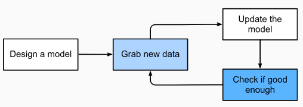

# [Introduction to Deep Learning](http://d2l.ai/chapter_introduction/intro.html) 

## Definition
 As ML algorithm accumulates more experience, typically in the form of observational data or interactions with an environment, their performance improves.In deep learning, the learning is the process by which we discover the right setting of the knobs coercing the desired behaviour from our model. Below is the flow of a typical training process - <be>
 
 
 ## Key Components
 Following are the core components, irrespective of ML problem we are trying to solve - 
 * **Data** 
 >1. Workable data is given a numerical representation with *features* and *covariates* as its numerical attributes.
 >2. Numerical values can be referred as *Vectors* and this fixed-length of vectors is called *dimensionality of data.*
 >3. *More and right* data means more powerful model.
 * **Model**
 * **Loss**
 * **Algorithm**
